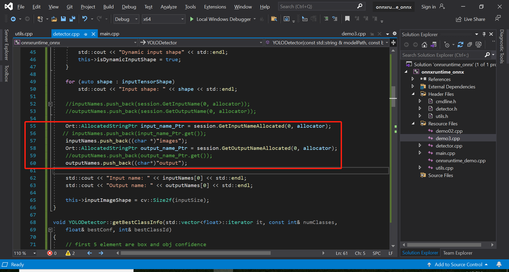

# C++ CPU环境下onnxruntime部署+项目运行

>windows10
>
>vs2019
>
>onnxruntime
>
>纯CPU环境
>
>官方yolov5代码


## VS配置

在【属性管理器】-【通用属性】-【VC++目录】-【包含目录】添加路径

　　D:\programFiles\Onnxruntime\onnxruntime-win-x64-1.15.0\include

在【属性管理器】-【通用属性】-【VC++目录】-【库目录】添加路径

　　D:\programFiles\Onnxruntime\onnxruntime-win-x64-1.15.0\lib

在【属性管理器】-【链接器】-【输入】-【附加依赖项】添加文件

　　onnxruntime.lib

最后，将onnxruntime.dll文件放在程序运行目录下边，使用Debug就放到Debug，Release就放到Release。或者将该文件根目录添加至Path环境变量（可能不生效）


# 项目运行

参考的这个仓库：https://github.com/itsnine/yolov5-onnxruntime/tree/master


但是需要将这里改一下：

https://blog.csdn.net/weixin_46068431/article/details/127970798

https://blog.csdn.net/weixin_45824067/article/details/130237533



用vs2019编译后，使用下面的命令进行运行

```
cd E:\CPP\onnxruntime_demo\onnxruntime_onnx\x64\Debug
# v5官方模型
onnxruntime_onnx --model_path E:/CPP/onnxruntime_demo/onnxruntime_Resources/yolov5m.onnx --image E:/CPP/onnxruntime_demo/onnxruntime_Resources/zidane.jpg --class_names E:/CPP/onnxruntime_demo/onnxruntime_Resources/coco.names

# 手势模型
onnxruntime_onnx --model_path E:/CPP/onnxruntime_demo/onnxruntime_Resources/v5s_gesture.onnx --image E:/CPP/onnxruntime_demo/onnxruntime_Resources/gesture_test.jpg --class_names E:/CPP/onnxruntime_demo/onnxruntime_Resources/gesture.names
```


# Reference

https://www.cnblogs.com/shaoxx333/p/17044934.html