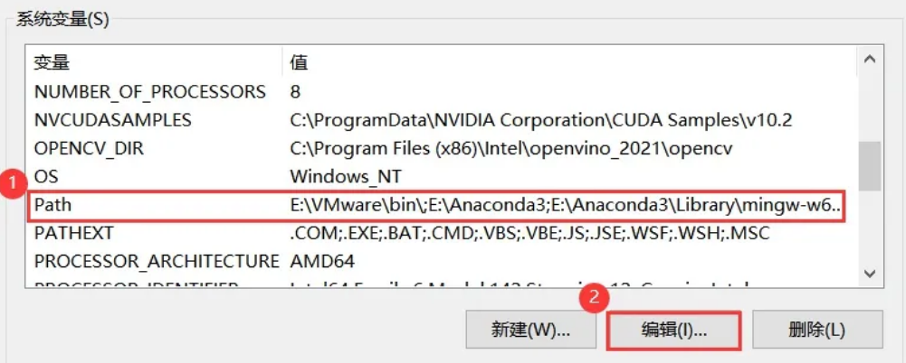
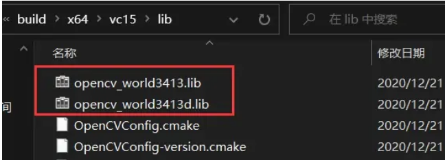
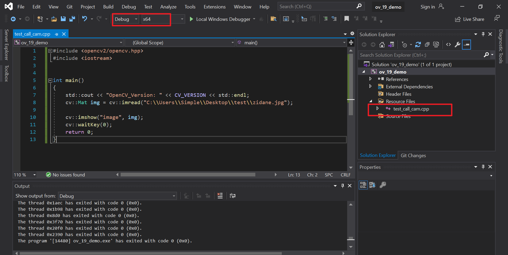

# 

【参考链接】https://blog.csdn.net/yohnyang/article/details/129670338


https://blog.csdn.net/shanglianlm/article/details/130485159


https://blog.csdn.net/qq_40700822/article/details/115709175

OpenVino C++ Yolov5 部署onnx

https://blog.csdn.net/p_mouren/article/details/127560473

https://blog.csdn.net/changzengli/article/details/129541176

https://blog.csdn.net/gdamichael/article/details/109692192


[toc]

# win10 vs2019安装配置openvino

> windows 10
>
> visual studio 2019
>
> opencv4.7.0
>
> openvino 2022.3.0
>
> 【参考链接】https://zhuanlan.zhihu.com/p/603685184

## 一、在vs中配置opencv

1、在系统变量中 path 路径下配置 opencv 的环境变量；



添加 opencv\build\x64\vc15\bin 目录到环境变量中；


2、 VS属性配置

**第一步，**打开VS，创建空项目，随后打开项目属性；

**第二步，**配置栏选择Debug，平台选择x64（针对64位的操作系统）；


**第三步，**配置包含目录；

首先，选择VC++目录→包含目录，如下：


然后，将 opencv\build\include 中的一个子文件夹以及文件夹本身的路径添加进去；

```
D:\programFiles\Opencv\opencv\build\include
D:\programFiles\Opencv\opencv\build\include\opencv2
```


**第四步，**配置库目录

选择VC++ → 库目录；


然后，将vc15中的lib库添加进去；

```
D:\programFiles\Opencv\opencv\build\x64\vc16\lib
```


**第五步，**配置附加依赖项；

首先，选择链接器 → 输入 → 附加依赖项；


然后，找到vc15/lib目录中的两个lib文件，如下图，添加符合当前模式的lib（Debug or Release）；

```
opencv_world470d.lib
# 注意要多个lib文件要加 分号；
```




需要说明的是：两个lib文件的区别在于：末尾是否有d！前者适用于Release模式，后者适用于Debug模式；

由于我们正在**Debug模式**下配置，因此选择第二个lib文件添加到附加依赖项中。如下；


到这里，我们的**VS+OpenCV**环境已搭建完毕，接下来，做一个简单的测试~~

```c++
#include <opencv2/opencv.hpp>
#include <iostream>


int main()
{
    std::cout << "OpenCV_Version: " << CV_VERSION << std::endl;
    cv::Mat img = cv::imread("C:\\Users\\Simple\\Desktop\\test\\zidane.jpg");

    cv::imshow("image", img);
    cv::waitKey(0);
    return 0;
}
```




## 二、在vs中配置openvino

和链接里写的一样


