# windows10_vs2019_c++_tensorRT_demo

>- windows 10
>- cuda 11.8
>- cudnn 8.9.2.26
>- tensorRT 8.6.1.6
>- RTX2060
>- Visual Studio 2019
>- C++
>- yolov5-6.2


## 导出trt engine

```
# 需要提前安装 nvidia-pyindex 和 onnx
pip install nvidia-pyindex
pip install onnx

# cd tensorrt文件夹下，安装对应python版本的tensorrt
pip install tensorrt-8.6.1-p39-none-win amd64.whl  
```

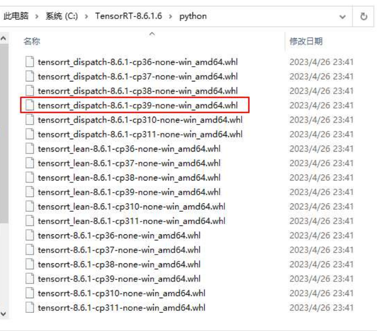

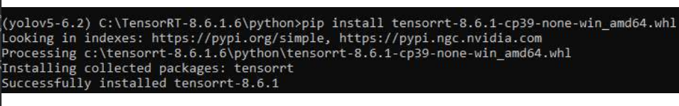

```
# 导出命令
python export.py --weights ./weights/yolov5s_official.pt --include engine --imgsz 640 --device 0 
```

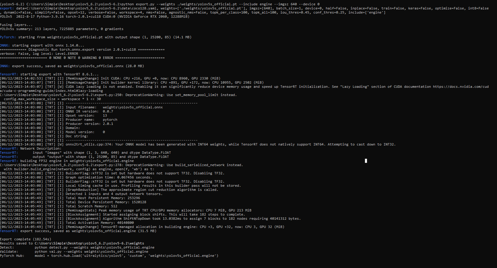

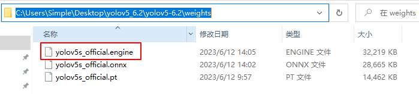


## 测试TensorRT推理引擎是否可用

测试TensorRT推理引擎是否可用

```
python detect.py --weights ./weights/yolov5s_official.engine --imgsz 640 --device 0  -source 0

# 可能会提示讲 protobuf 的版本过高
pip uninstall  protobuf
pip install protobuf==3.19.0  # 也会提示和其他依赖包版本冲突，但是能正常运行。
```

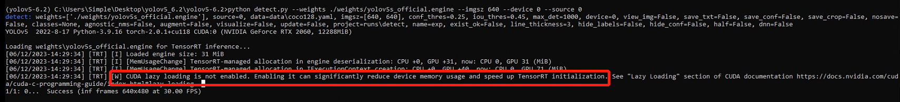

## 使用trtexec排查没加速的原因

>排查没加速的原因，使用trtexec工具
>
>- 先将 `C:\TensorRT-8.6.1.6\bin` 加入到系统环境变量中；
>- 在cmd中使用 `trtexec --loadEngine=C:/Users/Simple/Desktop/yolov5_6.2/yolov5-6.2/weights/yolov5s_official.engine --iterations=100 --avgRuns=10 --percentile=99` 命令查看模型性能参数。

其中：

- `100 `是进行推理的总迭代次数。
- `10`是计算平均推理时间时要考虑的运行次数。
- `99`是输出推理时间分位数的百分比值。

这将执行100次推理，每次推理将运行10次以计算平均值，并输出99th百分位数的推理时间。

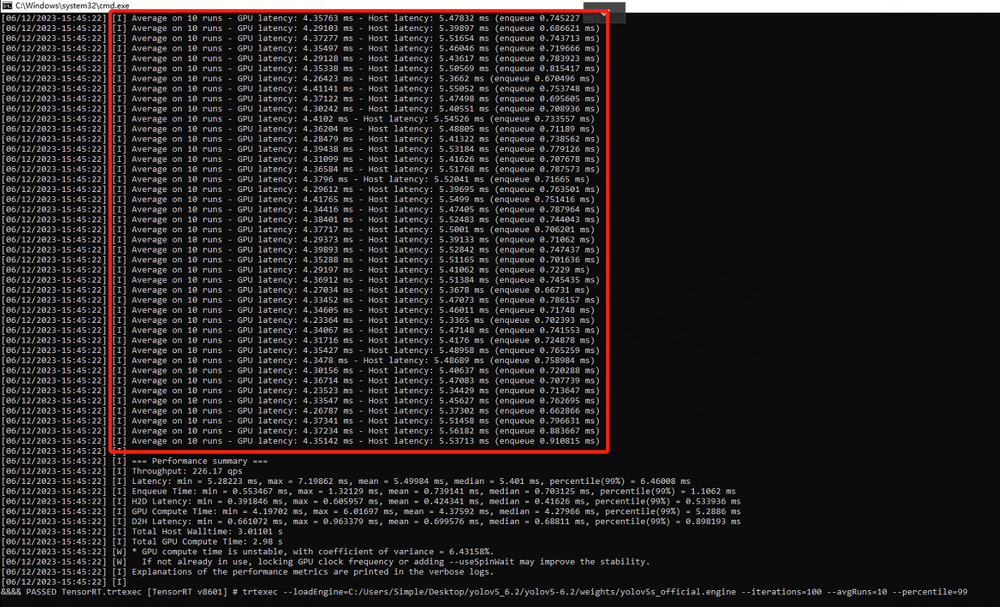

- `Average on 10 runs`: 这是基于10次运行的平均值。
- `GPU latency: 4.35142 ms`: 这是每帧的GPU延迟时间，即推理引擎在GPU上完成推理所需的时间。
- `Host latency: 5.53713 ms`: 这是每帧的主机延迟时间，即将数据从主机传输到GPU并获取推理结果所需的时间。
- `(enqueue 0.910815 ms)`: 这是将数据放入推理引擎队列的时间，也称为推理数据的排队时间。

综上所述，这句输出提供了关于每帧推理过程中GPU延迟、主机延迟和数据排队时间的详细信息。你可以使用这些数据来评估推理性能并进行优化分析。

原因：trtexec 每帧4ms，是正常的，没加速的原因是python的速度本身就慢。

## C++ 部署

vs2019环境配置

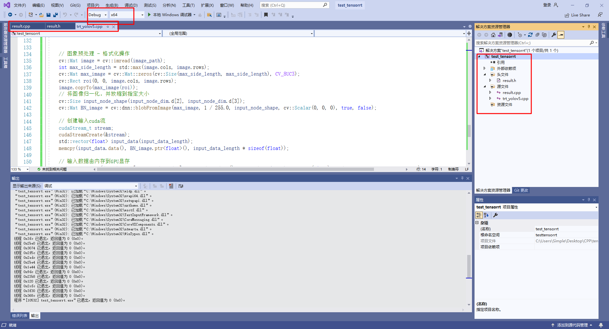

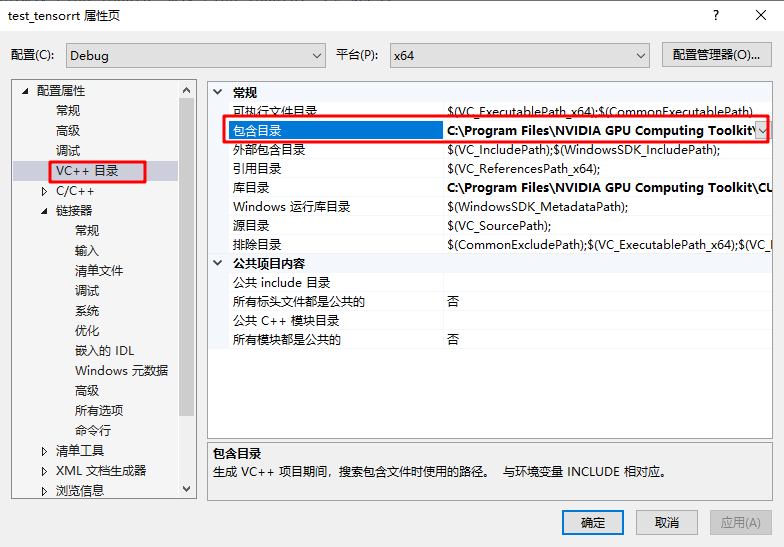

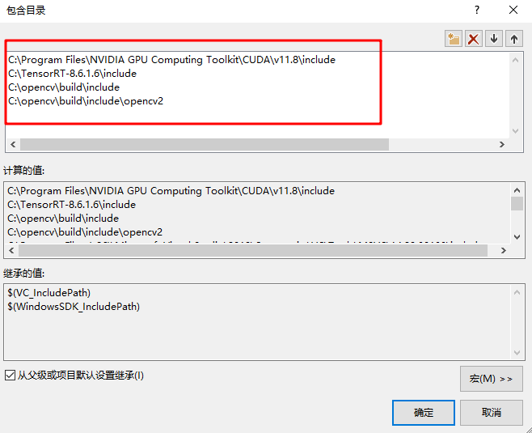

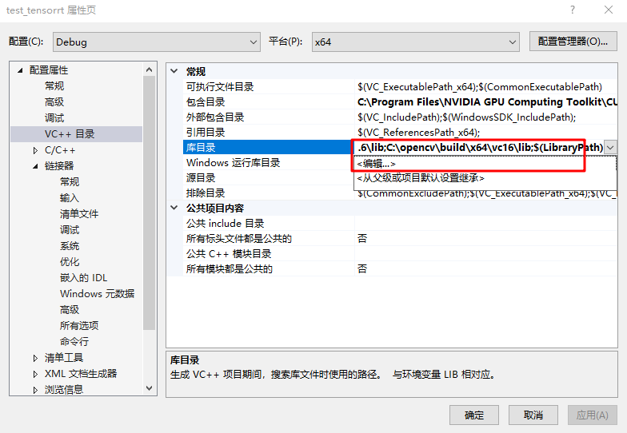

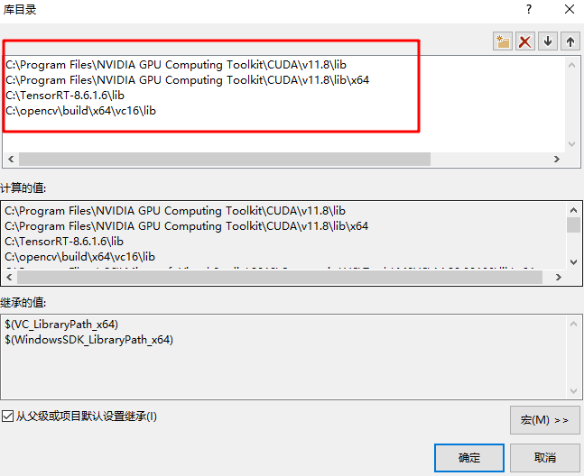

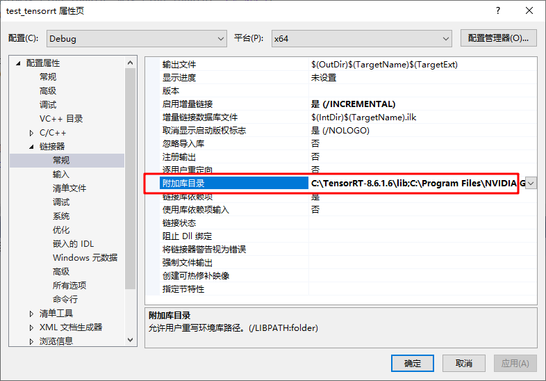

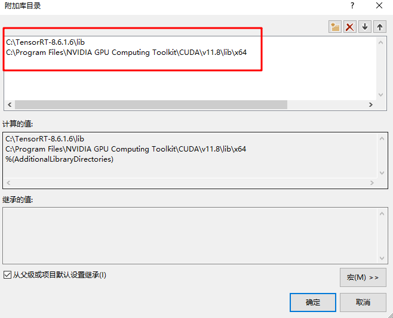

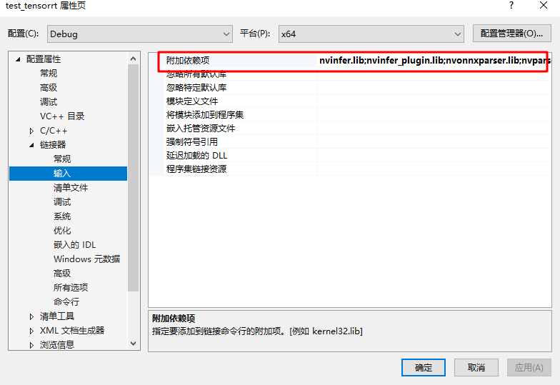

>**注意**，这一步一定要一个个写这些lib文件，直接写 `C:\TensorRT-8.6.1.6\lib\*.lib` 路径是不对的。
>
>nvinfer.lib
>nvinfer_plugin.lib
>nvonnxparser.lib
>nvparsers.lib
>cublas.lib
>cublasLt.lib
>cuda.lib
>cudadevrt.lib
>cudart.lib
>cudart_static.lib
>cudnn.lib
>cudnn64_8.lib
>cudnn_adv_infer.lib
>cudnn_adv_infer64_8.lib
>cudnn_adv_train.lib
>cudnn_adv_train64_8.lib
>cudnn_cnn_infer.lib
>cudnn_cnn_infer64_8.lib
>cudnn_cnn_train.lib
>cudnn_cnn_train64_8.lib
>cudnn_ops_infer.lib
>cudnn_ops_infer64_8.lib
>cudnn_ops_train.lib
>cudnn_ops_train64_8.lib
>cufft.lib
>cufftw.lib
>curand.lib
>cusolver.lib
>cusolverMg.lib
>cusparse.lib
>nppc.lib
>nppial.lib
>nppicc.lib
>nppidei.lib
>nppif.lib
>nppig.lib
>nppim.lib
>nppist.lib
>nppisu.lib
>nppitc.lib
>npps.lib
>nvblas.lib
>nvjpeg.lib
>nvml.lib
>nvrtc.lib
>OpenCL.lib
>opencv_world470d.lib

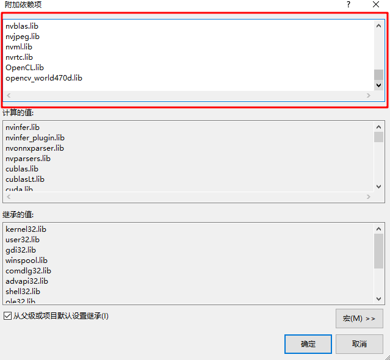

## reference

https://github.com/guojin-yan/Inference

https://blog.csdn.net/grape_yan/article/details/128550102

# Reference

https://blog.csdn.net/ChunjieShan/article/details/126120013

https://blog.51cto.com/u_15762365/5807839

