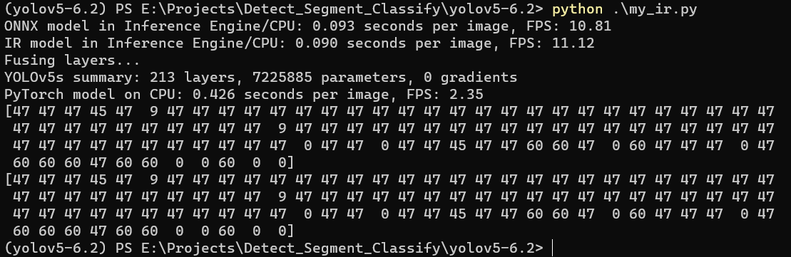

# yolov5 s.pt模型转 IR

>windows 10
>
>yolov5-6.2
>
>Python 3.8.16
>
>openvnio 2022.3.0
>
>openvino-dev 2022.3.0
>
>onnx                      1.14.0             
>onnx-simplifier           0.4.28                   
>onnxruntime               1.14.1               
>opencv-python             4.7.0.72
>torch					  2.0.1 - cpu
>
>【参考链接】https://blog.csdn.net/LH13471605976/article/details/125802182

1、安装所需环境

```
pip install openvino-dev
```

2、使用 yolov5s_6.2 官方代码导出

```
# weights 是我自己建的，官方没有这个文件夹
python export.py --weights weights/yolov5s.pt --include openvino
```

会在 weights 文件夹下生成一个名为 yolov5s_openvino_model 的文件夹，里面有 yolov5s.bin， yolov5s.mapping， yolov5s.xml， yolov5s.yaml 四个文件。

3、使用python进行推理测速对比

```python
# my_ir.py
# [my_draw_box_utils 文件参考链接] https://blog.csdn.net/mzl_18353516147/article/details/130719510

import cv2
import numpy as np
import torch
from PIL import Image
from openvino.runtime import Core
from utils.augmentations import letterbox
from utils.general import scale_coords, non_max_suppression
from my_draw_box_utils import draw_objs
import time
from models.experimental import attempt_load


coco80_names = ['person', 'bicycle', 'car', 'motorcycle', 'airplane', 'bus', 'train', 'truck', 'boat', 'traffic light',
                'fire hydrant', 'stop sign', 'parking meter', 'bench', 'bird', 'cat', 'dog', 'horse', 'sheep', 'cow',
                'elephant', 'bear', 'zebra', 'giraffe', 'backpack', 'umbrella', 'handbag', 'tie', 'suitcase', 'frisbee',
                'skis', 'snowboard', 'sports ball', 'kite', 'baseball bat', 'baseball glove', 'skateboard', 'surfboard',
                'tennis racket', 'bottle', 'wine glass', 'cup', 'fork', 'knife', 'spoon', 'bowl', 'banana', 'apple',
                'sandwich', 'orange', 'broccoli', 'carrot', 'hot dog', 'pizza', 'donut', 'cake', 'chair', 'couch',
                'potted plant', 'bed', 'dining table', 'toilet', 'tv', 'laptop', 'mouse', 'remote', 'keyboard',
                'cell phone', 'microwave', 'oven', 'toaster', 'sink', 'refrigerator', 'book', 'clock', 'vase',
                'scissors', 'teddy bear', 'hair drier', 'toothbrush']
weights = './weights/yolov5s.pt'
onnx_path = './weights/yolov5s.onnx'
img_path = "./data/images/zidane.jpg"
ir_path = './weights/yolov5s_openvino_model/yolov5s.xml'
num_images = 20


# 图像预处理
def preprocess():
    img_size = (640, 640)  # h, w
    origin_img = cv2.cvtColor(cv2.imread(img_path), cv2.COLOR_BGR2RGB)
    reshape_img, ratio, pad = letterbox(origin_img/255, img_size, auto=False)
    processed_img = np.expand_dims(np.transpose(reshape_img, [2, 0, 1]), 0).astype(np.float32)
    return processed_img,reshape_img,origin_img,ratio,pad

# 后处理
def post_process(result,reshape_img,origin_img,ratio,pad,save_name):
    result = non_max_suppression(torch.Tensor(result))[0]
    boxes = result[:, :4].numpy() # 坐标
    scores = result[:, 4].numpy() # 置信度
    cls = result[:, 5].numpy().astype(int)
    boxes = scale_coords(reshape_img.shape, boxes, origin_img.shape, (ratio, pad))

    draw_img = draw_objs(Image.fromarray(origin_img),
                         boxes,
                         cls,
                         scores,
                         category_index=dict([(str(i), v) for i, v in enumerate(coco80_names)]))
    draw_img.save(save_name)

# onnx模型推理
def onnx_infer(input_img):
    ie = Core()
    compiled_model_onnx = ie.compile_model(model=onnx_path, device_name='CPU')
    output_layer_onnx = compiled_model_onnx.output(0)
    # Run inference on the input image
    res_onnx = compiled_model_onnx([input_img])[output_layer_onnx]
    return res_onnx,compiled_model_onnx
# onnx推理20张图所用时间
def onnx_20(input_img,compiled_model_onnx):
    start = time.perf_counter()
    for _ in range(num_images):
        compiled_model_onnx([input_img])
    end = time.perf_counter()
    time_onnx = end - start
    print(
        f"ONNX model in Inference Engine/CPU: {time_onnx / num_images:.3f} "
        f"seconds per image, FPS: {num_images / time_onnx:.2f}"
    )


# 用IR模型推理
def IR_infer(input_img):
    ie = Core()
    model_ir = ie.read_model(model=ir_path)
    compiled_model_ir = ie.compile_model(model=model_ir, device_name="CPU")
    # Get input and output layers
    output_layer_ir = compiled_model_ir.output(0)
    # Run inference on the input image
    res_ir = compiled_model_ir([input_img])[output_layer_ir]
    return res_ir,compiled_model_ir

# IR推理20张图所用时间
def IR_20(input_img,compiled_model_ir):
    start = time.perf_counter()
    for _ in range(num_images):
        compiled_model_ir([input_img])
    end = time.perf_counter()
    time_ir = end - start
    print(
        f"IR model in Inference Engine/CPU: {time_ir / num_images:.3f} "
        f"seconds per image, FPS: {num_images / time_ir:.2f}"
    )

#使用pytorch模型推理
def pytorch_20(input_img):
    model = attempt_load(weights, device='cpu', inplace=True, fuse=True)
    with torch.no_grad():
        start = time.perf_counter()
        for _ in range(num_images):
            model(torch.as_tensor(input_img).float())
        end = time.perf_counter()
        time_torch = end - start
    print(
        f"PyTorch model on CPU: {time_torch / num_images:.3f} seconds per image, "
        f"FPS: {num_images / time_torch:.2f}"
    )


if __name__ == '__main__':
    input_img,reshape_img,origin_img,ratio,pad = preprocess()
    res_onnx, compiled_model_onnx = onnx_infer(input_img)
    res_ir,compiled_model_ir = IR_infer(input_img)
    onnx_20(input_img, compiled_model_onnx)
    IR_20(input_img,compiled_model_ir)
    pytorch_20(input_img)
    post_process(res_onnx,reshape_img,origin_img,ratio,pad,'predict_onnx.jpg')
    post_process(res_ir, reshape_img, origin_img, ratio, pad, 'predict_ir.jpg')

```

运行结果：



