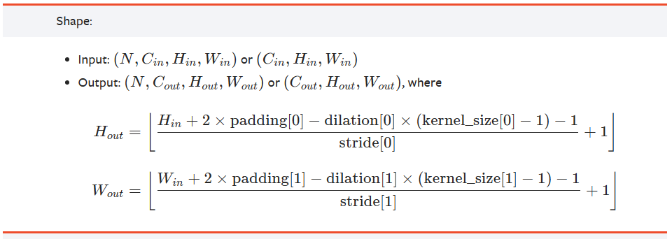
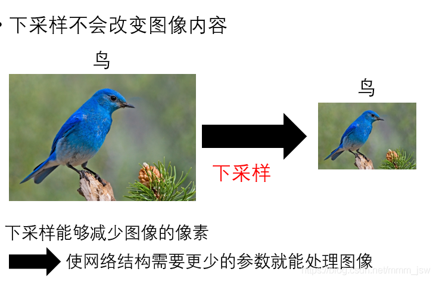

# 卷积神经网络

## 定义

卷积神经网络(convolutional neural network, CNN)，是一类包含卷积计算且具有深度结构的前馈神经网络（Feedforward Neural Networks）。卷积神经网络是受生物学上**感受野（Receptive Field）**的机制而提出的。卷积神经网络专门用来处理**具有类似网格结构的数据**的神经网络。例如，时间序列数据（可以认为是在时间轴上有规律地采样形成的一维网格） 和图像数据（可以看作是二维的像素网格）。

## 结构

一个卷积神经网络通常包括**输入输出层**和多个隐藏层，隐藏层通常包括**卷积层和RELU层（即激活函数）、池化层、全连接层和归一化层**等。

### 输入层

一般是二维向量，可以有高度，比如，RGB图像（三维度）。

### 卷积层（卷积+激活）

#### 参数

- **in_channels**：输入特征矩阵的深度。
- **out_channels**：输入特征矩阵的深度。
- **kernel_size**：卷积核的尺寸。
- **stride**：卷积核的步长。
- **padding**：补零操作，默认为0。

产生了网络中大部分的**计算量**。注意是计算量而不是参数量。// 什么是计算量和参数量?

卷积层与ReLU层共同称之为卷积层。

#### 卷积的三种模式

深度学习框架中通常会实现三种不同的卷积模式，分别是 SAME、VALID、FULL。

#### 卷积计算公式

$$
{\mathrm{Output}}={\frac{(\mathbf{W}-\mathbf{F}+2\mathbf{P})}{\mathbf{S}}}+1
$$

【link】https://pytorch.org/docs/1.13/generated/torch.nn.Conv2d.html?highlight=conv2d#torch.nn.Conv2d

> W : 输入图片大小 W×W（一般情况下Width=Height）
>
> F : Filter 大小 F×F
>
> S : 步长
>
> P : padding的像素数

### 池化层

池化层（又称为下采样），它的作用是减小数据处理量同时保留有用信息，池化层的作用可以描述为模糊图像，丢掉了一些不是那么重要的特征。

### 全连接层

## CNN的特点

### 局部感知

### 权重共享

### 多卷积核

# 参考

https://blog.csdn.net/mmm_jsw/article/details/88185491

