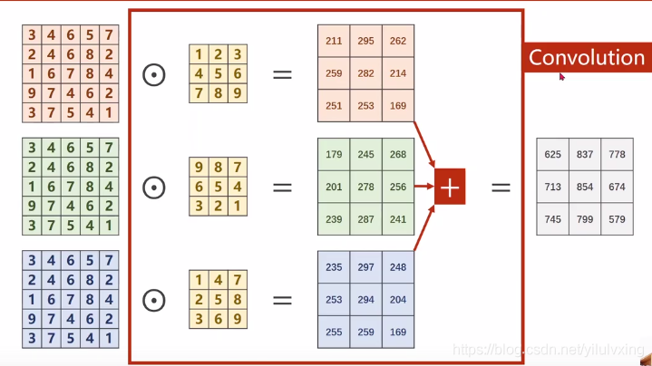

# 卷积层

## 单通道卷积

输入为（1,5,5），分别表示1个通道，宽为5，高为5。假设卷积核大小为3x3，padding=0，stride=1。

**卷积过程如下：**

**相应的卷积核不断的在图像上进行遍历，最后得到3x3的卷积结果，结果如下**

## 卷积公式：

$$
{\mathrm{Output}}={\frac{(\mathbf{W}-\mathbf{F}+2\mathbf{P})}{\mathbf{S}}}+1
$$

$$
{\mathrm{3}}={\frac{(\mathbf{5}-\mathbf{3}+2\mathbf{*0})}{\mathbf{1}}}+1
$$

> 输出的是一个` 1 * 3 * 3 ` 的 featuremap;
>
> 1 : 输出featuremap的通道数；
>
> 3 : 输出featuremap的 weight；
>
> 3 : 输出featuremap的 height。

## 多通道卷积-单个卷积核

输入为（3,5,5），分别表示3个通道，每个通道的宽为5，高为5。假设卷积核只有1个，卷积核通道为3，每个通道的卷积核大小仍为3x3，padding=0，stride=1。

卷积过程如下，每一个通道的像素值与对应的卷积核通道的数值进行卷积，因此每一个通道会对应一个输出卷积结果，三个卷积结果对应位置累加求和，得到最终的卷积结果（这里卷积输出结果通道只有1个，因为卷积核只有1个。**在单通道情况下，其实过滤器和卷积核可以看做一个东西，即 filter=kernel** 。卷积多输出通道下面会继续讲到）。

**上述过程中，每一个卷积核的通道数量，必须要求与输入通道数量一致，因为要对每一个通道的像素值要进行卷积运算，所以每一个卷积核的通道数量必须要与输入通道数量保持一致。**

我们把上述图像通道如果放在一块，计算原理过程还是与上面一样，堆叠后的表示如下：

## 多通道卷积-多个卷积核

如果要卷积后也输出多通道，增加卷积核（filers）的数量即可，示意图如下：

## 总结

**1：输入通道个数 等于 卷积核通道个数**

**2：卷积核个数 等于 输出通道个数**

# 参考

https://zhuanlan.zhihu.com/p/251068800

