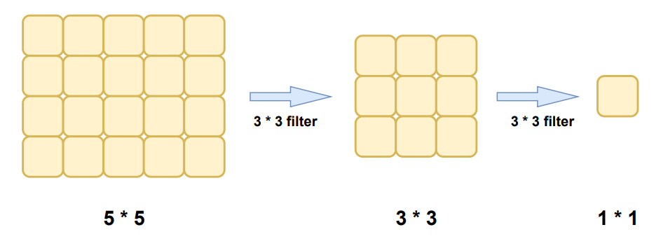
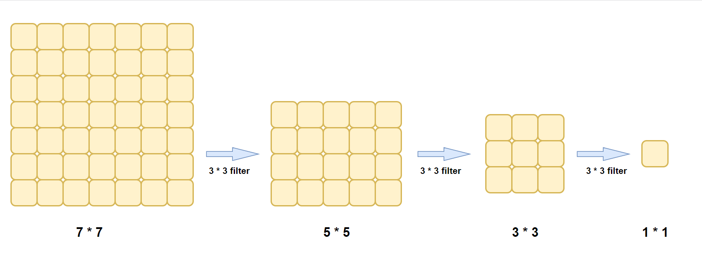

# 感受野

# 定义

感受野（Receptive Field）的定义：卷积神经网络每一层输出的特征图（feature map）上的像素点映射回输入图像上的区域大小。通俗点的解释是，特征图上一点，相对于原图的大小，也是卷积神经网络特征所能看到输入图像的区域。

## 举例

（1）若输入图像的尺寸大小是5 * 5，经过两次3 * 3的卷积核（其中stride=1,padding=0）后，其感受野大小为5 * 5，如下图所示。

（由卷积计算公式：**N=(W-F+2P)/S+1**，得到第一次卷积后的图像大小为3 * 3，第二次卷积后的图像大小为1 * 1）

（2）若输入图像的尺寸大小是7 * 7，经过三次3 * 3的卷积核（其中stride=1,padding=0）后，其感受野大小为7 * 7，如下图所示：

**随着卷积核的增多（即网络的加深），感受野会越来越大。**

