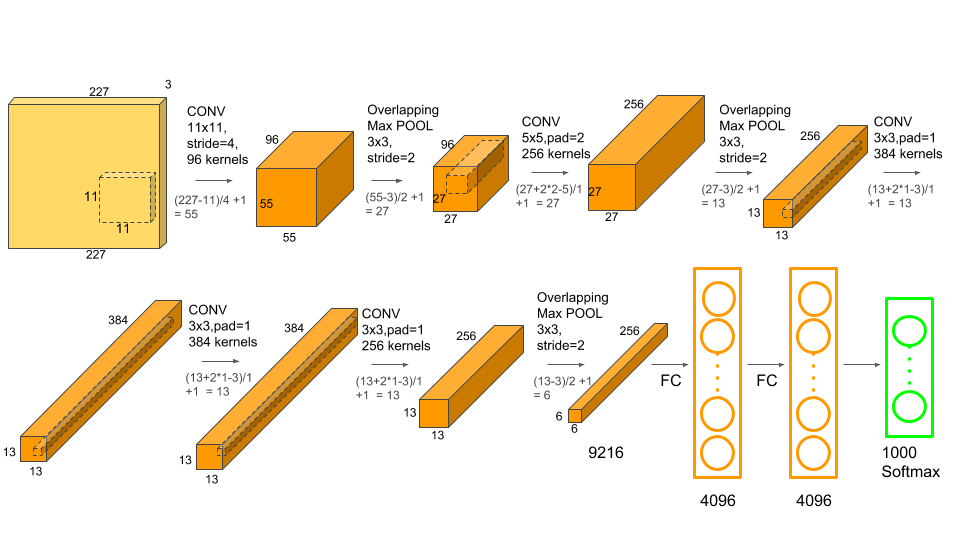

# Alexnet 模型详解

## 网络结构

AlexNet网络结构相对简单，使用了8层卷积神经网络，前5层是卷积层，剩下的3层是全连接层，具体如下所示。

从上图看，在网络设计上其实并非如上图所示，上图包含了GPU通信的部分。这是由当时GPU内存的限制引起的，作者使用两块GPU进行计算，因此分为了上下两部分。但是，以目前GPU的处理能力，单GPU足够了，因此其结构图可以如下所示：

---

**注意：**

- 原作者实验时用了两块GPU并行计算，上下两组图的结构是一样的；
- 原图输入224 × 224，实际上进行了随机裁剪，实际大小为227 × 227。

---

网络细化图

这里是设定输入是 `227 * 227`

## 模型亮点

- 首次利用GPU 进行网络加速训练；

- 使用数据增强Data Augmentation抑制过拟合；

- 使用了 ReLU 激活函数，而不是传统的 sigmoid 激活函数以及 Tanh 激活函数；

  > 采用修正线性单元(ReLU)的深度卷积神经网络训练时间比等价的tanh单元要快几倍。同时，ReLU有效防止了过拟合现象的出现。

- 使用了LRN 局部响应归一化；

- 在全连接层的前两层中使用了 Dropout随机失活神经元操作，以减少过拟合。

  > Dropout的方式在网络正向传播过程中随机失活一部分神经元，以减少过拟合
  >
  > 

## 详细解读

### Conv1

- 输入：input_size = [224, 224, 3]
- 卷积层：
  - kernels = 48 * 2 = 96 组卷积核
  - kernel_size = 11
  - padding = [1, 2] （左上围加半圈0，右下围加2倍的半圈
  - stride = 4
- 输出：output_size = [55, 55, 96]

经 Conv1 卷积后的输出层尺寸为：
$$
\operatorname{Output}=\frac{(W-F+2P)}{S}+1=\frac{[224-11+(1+2)]}{4}+1=55
$$

> - 输入图片大小 W×W（一般情况下Width=Height）
> - Filter大小F×F
> - 步长 S
> - padding的像素数 P

### Maxpool1

- 输入：input_size = [55, 55, 96]
- 池化层：（只改变尺寸，不改变深度channel）
  - kernel_size = 3
  - padding = 0
  - stride = 2

- 输出：output_size = [27, 27, 96]

经 Maxpool1 后的输出层尺寸为：
$$
\operatorname{Output}=\frac{(W-F+2\operatorname{P})}{\operatorname{S}}+1=\frac{(55-3)}{2}+1=27
$$

### Conv2

- 输入：input_size = [27, 27, 96]
- 卷积层：
  - kernels = 128 * 2 = 256 组卷积核
  - kernel_size = 5 * 5
  - padding = [2, 2]
  - stride = 1
- 输出：output_size = [27, 27, 256]

经 Conv2 卷积后的输出层尺寸为：
$$
\operatorname{Output}=\frac{(\operatorname{W}-\operatorname{F}+2\operatorname{P})}{\operatorname{S}}+1=\frac{[27-5+(2+2)]}{1}+1=27
$$

### Maxpool2

- 输入：input_size = [27, 27, 256]
- 池化层：（只改变尺寸，不改变深度channel）
  - kernel_size = 3
  - padding = 0
  - stride = 2
- 输出：output_size = [13, 13, 256]

经 Maxpool2 后的输出层尺寸为：
$$
\text{Output}=\frac{\left(\operatorname{W}-\operatorname{F}+2\operatorname{P}\right)}{\operatorname{S}}+1=\frac{\left(27-3\right)}{2}+1=13
$$

### Conv3

- 输入：input_size = [13, 13, 256]
- 卷积层：
  - kernels = 192* 2 = 384 组卷积核
  - kernel_size = 3
  - padding = [1, 1]
  - stride = 1
- 输出：output_size = [13, 13, 384]

经 Conv3 卷积后的输出层尺寸为：
$$
\operatorname{Output}=\frac{(\operatorname{W}-\operatorname{F}+2\operatorname{P})}{\mathrm{S}}+1=\frac{[13-3+(1+1)]}{1}+1=13
$$

### Conv4

- 输入：input_size = [13, 13, 384]
- 卷积层：
  - kernels = 192* 2 = 384 组卷积核
  - kernel_size = 3
  - padding = [1, 1]
  - stride = 1
- 输出：output_size = [13, 13, 384]

经 Conv4 卷积后的输出层尺寸为：
$$
\operatorname{Output}=\frac{(\operatorname{W}-\operatorname{F}+2\operatorname{P})}{\operatorname{S}}+1=\frac{[13-3+(1+1)]}{1}+1=13
$$

### Conv5

- 输入：input_size = [13, 13, 384]
- 卷积层:
  - kernels = 128* 2 = 256 组卷积核
  - kernel_size = 3
  - padding = [1, 1]
  - stride = 1
- 输出：output_size = [13, 13, 256]

经 Conv5 卷积后的输出层尺寸为：
$$
\text{Output}=\frac{(W-F+2P)}{S}+1=\frac{[13-3+(1+1)]}{1}+1=13
$$

### Maxpool3

- 输入：input_size = [13, 13, 256]
- 池化层：（只改变尺寸，不改变深度channel）
  - kernel_size = 3
  - padding = 0
  - stride = 2
- 输出：output_size = [6, 6, 256]

经 Maxpool3 后的输出层尺寸为：
$$
\operatorname{Output}=\frac{(W-F+2\mathrm P)}{\mathrm S}+1=\frac{(13-3)}{2}+1=6
$$

### FC1、FC2、FC3

> Maxpool3 → (6*6*256) → FC1 → 2048 → FC2 → 2048 → FC3 → 1000
>
> 最终的1000可以根据数据集的类别数进行修改。

分析可以发现，除 Conv1 外，AlexNet 的其余卷积层都是在改变特征矩阵的深度，而池化层则只改变（减小）其尺寸。

## 模型参数

AlexNet有六千万亿个参数和650,000个神经元。

> 卷积层的参数 = 卷积核的数量 * 卷积核 + 偏置

## 模型效果

在2010年的ImageNet LSVRC-2010上，AlexNet在给包含有1000种类别的共120万张高分辨率图片的分类任务中，在测试集上的top-1和top-5错误率为37.5%和17.0%（**top-5 错误率：即对一张图像预测5个类别，只要有一个和人工标注类别相同就算对，否则算错。同理top-1对一张图像只预测1个类别**），在ImageNet LSVRC-2012的比赛中，取得了top-5错误率为15.3%的成绩。

# Reference

https://blog.csdn.net/m0_37867091/article/details/107150142

https://blog.csdn.net/guzhao9901/article/details/118552085

https://learnopencv.com/understanding-alexnet/

https://blog.csdn.net/muye_IT/article/details/123602605

https://blog.csdn.net/muye_IT/article/details/123895360

https://www.cnblogs.com/wangguchangqing/p/10333370.html

https://zhuanlan.zhihu.com/p/42914388

https://zh.d2l.ai/chapter_convolutional-modern/alexnet.html#id3
