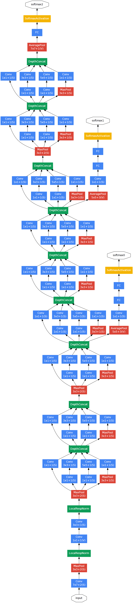
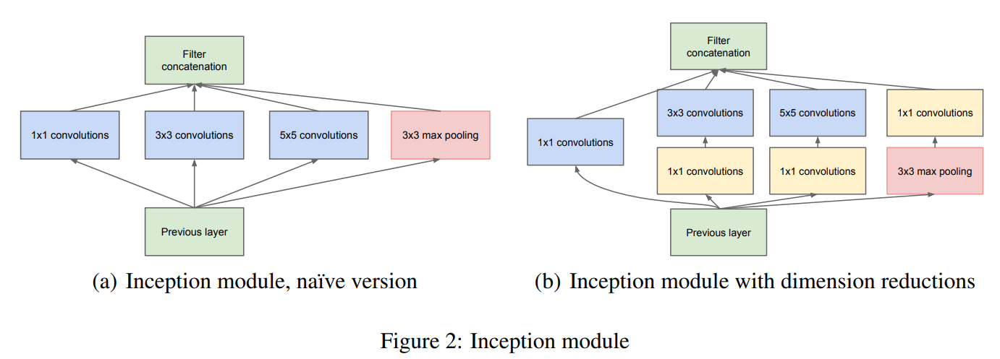
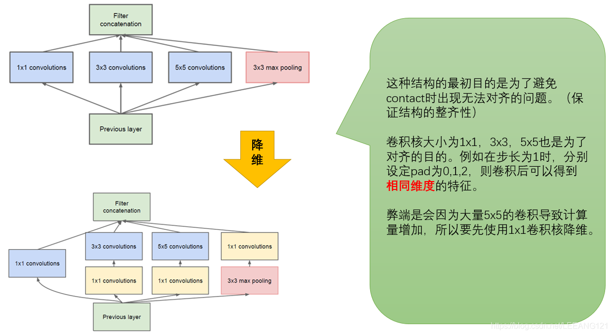
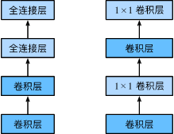
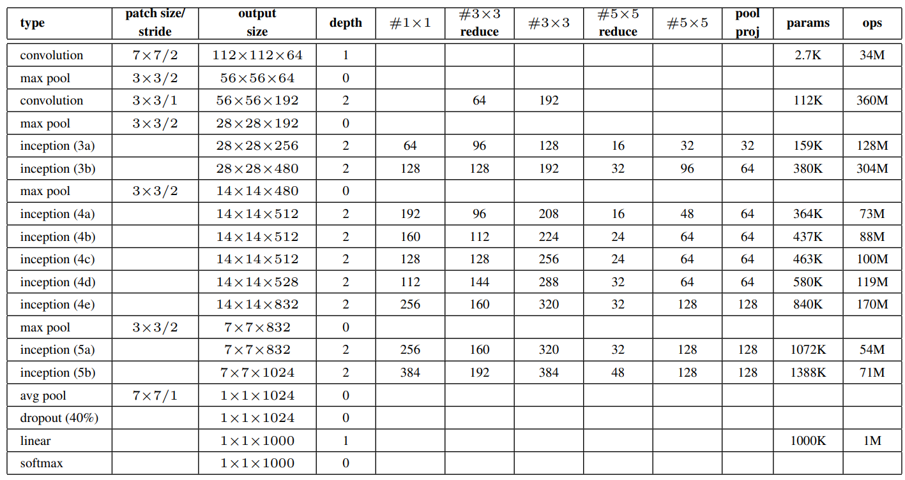

[toc]

# Google net

## 模型介绍

VGG在2014年ImageNet 中获得了定位任务第1名和分类任务第2名的好成绩，而同年分类任务的第一名则是**GoogleNet** 

> "Inception"（得名于同名电影《盗梦空间》（Inception））

VGG继承了LeNet以及AlexNet的一些框架结构，而GoogLeNet则做了更加大胆的网络结构尝试，虽然深度只有22层，但大小却比AlexNet和VGG小很多，GoogleNet参数为500万个，AlexNet参数个数是GoogleNet的12倍，VGGNet参数又是AlexNet的3倍，因此在内存或计算资源有限时，GoogleNet是比较好的选择；从模型结果来看，GoogLeNet的性能却更加优越。

## 模型亮点

- 提出Inception结构在多个尺寸上同时进行卷积再聚合；
- 使用1X1的卷积进行降维以及映射处理；
- 添加两个辅助分类器帮助训练；辅助分类器是将中间某一层的输出用作分类,并按一个较小的权重加到最终分类结果中；
- 使用平均池化层代替全连接层，大大减少了参数量。

## 模型详解

（1）GoogLeNet采用了模块化的结构（Inception结构），方便增添和修改；
（2）网络最后采用了average pooling（平均池化）来代替全连接层，该想法来自NIN（Network in Network），事实证明这样可以将准确率提高0.6%。但是，实际在最后还是加了一个全连接层，主要是为了方便对输出进行灵活调整；
（3）虽然移除了全连接，但是网络中依然使用了Dropout ;
（4）为了避免梯度消失，网络额外增加了2个辅助的softmax用于向前传导梯度（辅助分类器）。辅助分类器是将中间某一层的输出用作分类，并按一个较小的权重（0.3）加到最终分类结果中，这样相当于做了模型融合，同时给网络增加了反向传播的梯度信号，也提供了额外的正则化，对于整个网络的训练很有裨益。而在实际测试的时候，这两个额外的softmax会被去掉。

### Inception

Inception模块只会改变特征图的通道数，而不会改变尺寸大小。

**Inception 架构的主要思想是找出如何让已有的稠密组件接近于覆盖卷积视觉网络中的最佳局部稀疏结构**。作者首先提出下面这样的基本结构

**GoogLeNet是如何进一步提升性能的呢？**

一般来说，提升网络性能最直接的办法就是增加网络深度和宽度，深度指网络层次数量、宽度指神经元数量。但这种方式存在以下问题：
（1）参数太多，如果训练数据集有限，很容易产生过拟合；
（2）网络越大、参数越多，计算复杂度越大，难以应用；
（3）网络越深，容易出现梯度弥散问题（梯度越往后穿越容易消失），难以优化模型。

解决这些问题的方法当然就是在增加网络深度和宽度的同时减少参数，为了减少参数，自然就想到将全连接变成稀疏连接。

但是在实现上，全连接变成稀疏连接后实际计算量并不会有质的提升，因为大部分硬件是针对密集矩阵计算优化的，稀疏矩阵虽然数据量少，但是计算所消耗的时间却很难减少。

那么，有没有一种方法既能保持网络结构的稀疏性，又能利用密集矩阵的高计算性能。大量的文献表明可以将稀疏矩阵聚类为较为密集的子矩阵来提高计算性能，就如人类的大脑是可以看做是神经元的重复堆积，因此，GoogLeNet团队提出了Inception网络结构，就是构造一种“基础神经元”结构，来搭建一个稀疏性、高计算性能的网络结构。

Inception历经了V1、V2、V3、V4等多个版本的发展，不断趋于完善，下面一一进行介绍

通过设计一个稀疏网络结构，但是能够产生稠密的数据，既能增加神经网络表现，又能保证计算资源的使用效率。谷歌提出了最原始Inception的基本结构：

### NiN

为了增加神经网络的表现能力提出了 Network-in-Network 的新方法，在他们的模型网络中添加了 1×1 的卷积层。这里首先解释一下什么是 Network-in-Network（简称 NiN）。在 AlexNet 和 VGG 的网络中，都是 `Conv->Conv->FC->FC` 这种结构，而 NiN 使用 1×1 的卷积层来代替全连接层，从而使空间信息能够自然传递到后面的层去，下图对比了 NiN 同 AlexNet 和 VGG 等网络在结构上的主要区别（右边的是 NiN 结构）

###  1×1 的卷积

1x1卷积的主要目的是为了减少维度，还用于修正线性激活（ReLU）。比如，上一层的输出为100x100x128，经过具有256个通道的5x5卷积层之后(stride=1，pad=2)，输出数据为100x100x256，其中，卷积层的参数为128x5x5x256= 819200。而假如上一层输出先经过具有32个通道的1x1卷积层，再经过具有256个输出的5x5卷积层，那么输出数据仍为100x100x256，但卷积参数量已经减少为128x1x1x32 + 32x5x5x256= 204800，大约减少了4倍。

### 辅助分类器

1. avg-pooling size=5×5，stride=3，(4a) 的输出为 4×4×512，(4d) 的输出为 4×4×528
2. 具有 128 个卷积核的 1×1 小卷积，作用是降维和 ReLU 激活
3. FC layer 有 1024 个单元和 ReLU 激活函数
4. Dropout 的失活概率为 30%
5. 使用带有 Softmax 损失的线性层作为分类器

**GoogLeNet的网络结构图细节如下：**

**注：上表中的“#3x3 reduce”，“#5x5 reduce”表示在3x3，5x5卷积操作之前使用了1x1卷积的数量。**

**GoogLeNet网络结构明细表解析如下：**
**0、输入**
原始输入图像为224x224x3，且都进行了零均值化的预处理操作（图像每个像素减去均值）。
**1、第一层（卷积层）**
使用7x7的卷积核（滑动步长2，padding为3），64通道，输出为112x112x64，卷积后进行ReLU操作
经过3x3的max pooling（步长为2），输出为((112 - 3+1)/2)+1=56，即56x56x64，再进行ReLU操作
**2、第二层（卷积层）**
使用3x3的卷积核（滑动步长为1，padding为1），192通道，输出为56x56x192，卷积后进行ReLU操作
经过3x3的max pooling（步长为2），输出为((56 - 3+1)/2)+1=28，即28x28x192，再进行ReLU操作
**3a、第三层（Inception 3a层）**
分为四个分支，采用不同尺度的卷积核来进行处理
（1）64个1x1的卷积核，然后RuLU，输出28x28x64
（2）96个1x1的卷积核，作为3x3卷积核之前的降维，变成28x28x96，然后进行ReLU计算，再进行128个3x3的卷积（padding为1），输出28x28x128
（3）16个1x1的卷积核，作为5x5卷积核之前的降维，变成28x28x16，进行ReLU计算后，再进行32个5x5的卷积（padding为2），输出28x28x32
（4）pool层，使用3x3的核（padding为1），输出28x28x192，然后进行32个1x1的卷积，输出28x28x32。
将四个结果进行连接，对这四部分输出结果的第三维并联，即64+128+32+32=256，最终输出28x28x256
**3b、第三层（Inception 3b层）**
（1）128个1x1的卷积核，然后RuLU，输出28x28x128
（2）128个1x1的卷积核，作为3x3卷积核之前的降维，变成28x28x128，进行ReLU，再进行192个3x3的卷积（padding为1），输出28x28x192
（3）32个1x1的卷积核，作为5x5卷积核之前的降维，变成28x28x32，进行ReLU计算后，再进行96个5x5的卷积（padding为2），输出28x28x96
（4）pool层，使用3x3的核（padding为1），输出28x28x256，然后进行64个1x1的卷积，输出28x28x64。
将四个结果进行连接，对这四部分输出结果的第三维并联，即128+192+96+64=480，最终输出输出为28x28x480
第四层（4a,4b,4c,4d,4e）、第五层（5a,5b）……，与3a、3b类似，在此就不再重复。

# 总结

总体结构：

1. 包括 Inception 模块的所有卷积，都采用了 ReLU 激活函数
2. 输入图像的大小是 3×224×224，并且对 RGB 三通道都减去了均值
3. \#3×3 reduce 和 #5×5 分别表示 3×3 和 5×5 的卷积前，降维层所用的 1×1 卷积核的数量；pool proj 表示进行 max-pooling 之后，投影层所用的 1×1 卷积核的数量。所有的这些降维 / 投影层也都使用了 ReLU
4. 网络包含 22 个带参数的层（如果考虑 pooling 层就是 27 层），独立成块的层总共有约有 100 个
5. 网络中间的层次生成的特征会非常有区分性，给这些层增加一些辅助分类器。这些分类器以小卷积网络的形式放在 Inception (4a) 和 Inception (4b) 的输出上。在训练过程中，损失会根据折扣后的权重（折扣权重为 0.3）叠加到总损失中

# Reference

https://blog.csdn.net/qq_37555071/article/details/108214680

https://blog.csdn.net/weixin_43598687/article/details/125626247

https://wmathor.com/index.php/archives/1383/

https://www.guyuehome.com/34487

https://blog.csdn.net/weixin_43598687/article/details/125626247