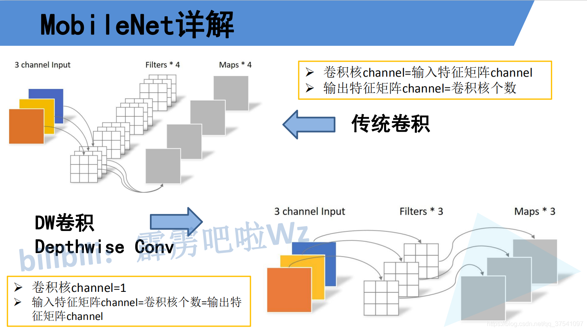
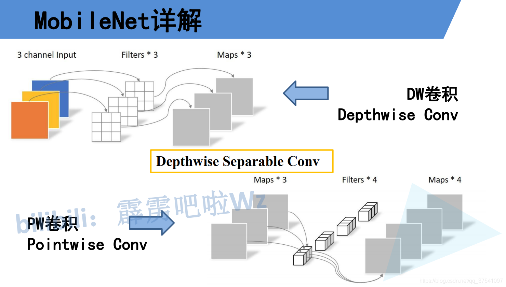
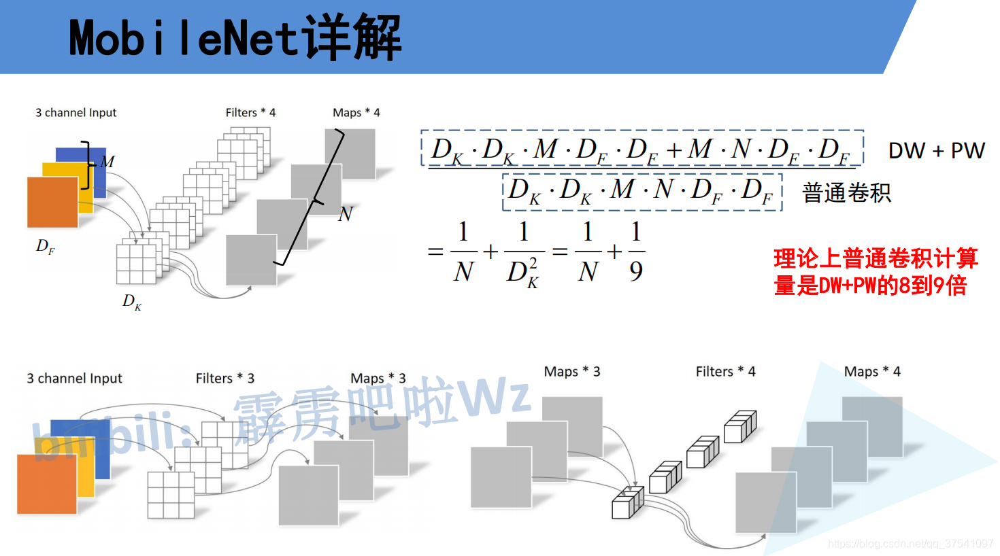
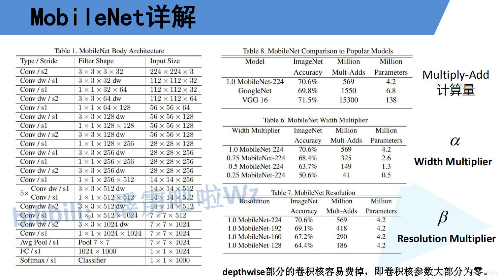

# 

# MobileNet v1

## 概述

MobileNet网络是由google团队在2017年提出的，专注于移动端或者嵌入式设备中的轻量级CNN网络。相比传统卷积神经网络，在准确率小幅降低的前提下大大减少模型参数与运算量。(相比VGG16准确率减少了0.9%，但模型参数只有VGG的1/32)。
要说MobileNet网络的优点，无疑是其中的Depthwise Convolution结构(大大减少运算量和参数数量)。下图展示了传统卷积与DW卷积的差异，在传统卷积中，每个卷积核的channel与输入特征矩阵的channel相等（每个卷积核都会与输入特征矩阵的每一个维度进行卷积运算）。而在DW卷积中，每个卷积核的channel都是等于1的（每个卷积核只负责输入特征矩阵的一个channel，故卷积核的个数必须等于输入特征矩阵的channel数，从而使得输出特征矩阵的channel数也等于输入特征矩阵的channel数）

刚刚说了使用DW卷积后输出特征矩阵的channel是与输入特征矩阵的channel相等的，如果想改变/自定义输出特征矩阵的channel，那只需要在DW卷积后接上一个PW卷积即可，如下图所示，其实PW卷积就是普通的卷积而已（只不过卷积核大小为1）。通常DW卷积和PW卷积是放在一起使用的，一起叫做Depthwise Separable Convolution（深度可分卷积）。

那Depthwise Separable Convolution（深度可分卷积）与传统的卷积相比有到底能节省多少计算量呢，下图对比了这两个卷积方式的计算量，其中Df是输入特征矩阵的宽高（这里假设宽和高相等），Dk是卷积核的大小，M是输入特征矩阵的channel，N是输出特征矩阵的channel，卷积计算量近似等于卷积核的高 x 卷积核的宽 x 卷积核的channel x 输入特征矩阵的高 x 输入特征矩阵的宽（这里假设stride等于1），在我们mobilenet网络中DW卷积都是是使用3x3大小的卷积核。所以理论上普通卷积计算量是DW+PW卷积的8到9倍（公式来源于原论文）：

在了解完Depthwise Separable Convolution（深度可分卷积）后在看下mobilenet v1的网络结构，左侧的表格是mobileNetv1的网络结构，表中标Conv的表示普通卷积，Conv dw代表刚刚说的DW卷积，s表示步距，根据表格信息就能很容易的搭建出mobileNet v1网络。在mobilenetv1原论文中，还提出了两个超参数，一个是α一个是β。α参数是一个倍率因子，用来调整卷积核的个数，β是控制输入网络的图像尺寸参数，下图右侧给出了使用不同α和β网络的分类准确率，计算量以及模型参数：

# Reference

https://blog.csdn.net/qq_37541097/article/details/105771329

