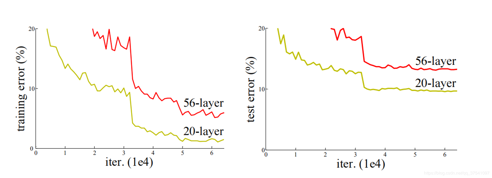
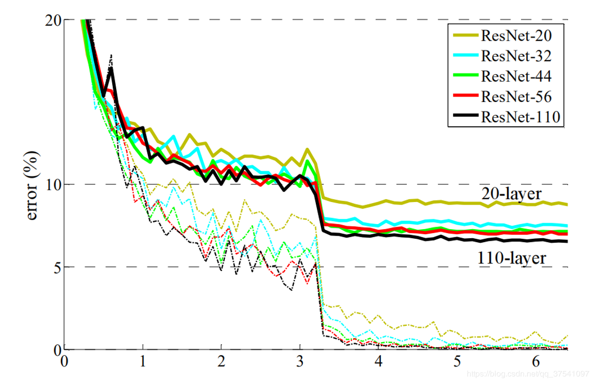
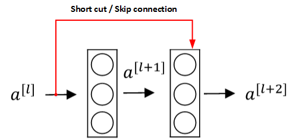

# ResNet50

# 综述

## 亮点

- （1）提出residual结构（残差结构），并搭建超深的网络结构(突破1000层)
- （2）使用Batch Normalization加速训练(丢弃dropout)

## 详解

### Why residual?

在ResNet网络提出之前，传统的卷积神经网络都是通过将一系列卷积层与池化层进行堆叠得到的。一般我们会觉得网络越深，特征信息越丰富，模型效果应该越好。但是实验证明，当网络堆叠到一定深度时，会出现两个问题：

1. **梯度消失或梯度爆炸**

   >关于梯度消失和梯度爆炸，其实看名字理解最好：
   >若每一层的误差梯度小于1，反向传播时，网络越深，梯度越趋近于0；
   >反之，若每一层的误差梯度大于1，反向传播时，网路越深，梯度越来越大

2. **退化问题**(degradation problem)

   在解决了梯度消失、爆炸问题后，仍然存在深层网络的效果可能比浅层网络差的现象。

总结就是，**当网络堆叠到一定深度时，反而会出现深层网络比浅层网络效果差的情况**。

如下图所示，20层网络 反而比 56层网络 的误差更小：

- 对于梯度消失或梯度爆炸问题，ResNet论文提出通过数据的预处理以及在网络中使用 [**BN**（**Batch Normalization**）](https://blog.csdn.net/qq_37541097/article/details/104434557)层来解决。

- 对于退化问题，ResNet论文提出了 **residual结构**（**残差结构**）来减轻退化问题，下图是使用residual结构的卷积网络，可以看到随着网络的不断加深，效果并没有变差，而是变的更好了。（虚线是train error，实线是test error）

  

  

### What is residual？

为了解决深层网络中的退化问题，可以人为地让神经网络某些层跳过下一层神经元的连接，<mark>隔层相连，弱化每层之间的强联系</mark>。这种神经网络被称为 **残差网络** (**ResNets**)。

残差网络由许多隔层相连的神经元子模块组成，我们称之为 **残差块** **Residual block**。单个残差块的结构如下图所示：

上图中红色部分称为 **short cut** 或者 **skip connection**（也称 捷径分支），**直接建立**$\mathbf{a}^{[l]}$与$\mathbf{a}^{[l+2]}$之间的**隔层联系**。其前向传播的计算步骤为：
$$
\begin{aligned}
&\bullet\text{z}^{[l+1]} =\mathrm{W}^{[l+1]}\mathrm{a}^{[l]}+\mathrm{b}^{[l+1]}  \\
&\bullet\text{a}^{[l+1]} =\mathrm{g}(\mathrm{z}^{[l+1]})  \\
&\bullet \mathrm{z}^{[l+2]} =\mathrm{W}^{[l+2]}\mathrm{a}^{[l+1]}+\mathrm{b}^{[l+2]}  \\
&\bullet\text{a}^{[l+2]} =\mathrm{g}\left(\mathrm{z}^{[l+2]}+\mathrm{a}^{[l]}\right) 
\end{aligned}
$$
$\mathbf{a}^{[l]}$直接隔层与下一层的线性输出相连，与$\mathbf{z}^{[l+2]}$ 共同通过激活函数（ReLU）输出$\mathbf{a}^{[l+2]}$

由多个 残差块 组成的神经网络就是 残差网络 。其结构如下图所示：

实验表明，这种模型结构对于训练非常深的神经网络,效果很好。另外，为了便于区分，我们把 **非残差网络** 称为 **Plain Network。**

### ResNet中的残差结构

实际应用中，残差结构的 short cut 不一定是隔一层连接，也可以中间隔多层，ResNet所提出的残差网络中就是隔多层。跟VggNet类似，ResNet也有多个不同层的版本，而残差结构也有两种对应浅层和深层网络：

|          |    **ResNet**    | **残差结构** |
| :------: | :--------------: | :----------: |
| 浅层网络 |   ResNet18/34    |  BasicBlock  |
| 深层网络 | ResNet50/101/152 |  Bottleneck  |

下图中左侧残差结构称为 **BasicBlock**，右侧残差结构称为 **Bottleneck**

对于深层的 Bottleneck，1×1的卷积核起到降维和升维（特征矩阵深度）的作用，同时可以大大减少网络参数。

>可以计算一下，假设两个残差结构的输入特征和输出特征矩阵的深度都是256维，如下图：（注意左侧结构的改动）
>
>
>
>那么两个残差结构所需的参数为：
>
>- 左侧：$ 3\times3\times256\times256+3\times3\times256\times256=1,179,648 $
>- 右侧：$1\times1\times256\times64+3\times3\times64\times64+1\times1\times64\times256=69,632$
>
>注：CNN参数个数 = 卷积核尺寸×卷积核深度 × 卷积核组数 = 卷积核尺寸 × 输入特征矩阵深度 × 输出特征矩阵深度
>明显搭建深层网络时，使用右侧的残差结构更合适。

### 降维时的 short cut

观察下图的 ResNet18层网络，可以发现有些残差块的 short cut 是实线的，而有些则是虚线的。

这些虚线的 short cut 上通过1×1的卷积核进行了维度处理（特征矩阵在长宽方向降采样，深度方向调整成下一层残差结构所需要的channel）

下图是原论文给出的不同深度的ResNet网络结构配置，注意表中的残差结构给出了主分支上卷积核的大小与卷积核个数，表中 残差块×N 表示将该残差结构重复N次。

原文的表注中已说明，conv3_x, conv4_x, conv5_x所对应的一系列残差结构的第一层残差结构都是虚线残差结构。因为这一系列残差结构的第一层都有调整输入特征矩阵shape的使命（将特征矩阵的高和宽缩减为原来的一半，将深度channel调整成下一层残差结构所需要的channel）
需要注意的是，对于ResNet50/101/152，其实conv2_x所对应的一系列残差结构的第一层也是虚线残差结构，因为它需要调整输入特征矩阵的channel。根据表格可知通过3x3的max pool之后输出的特征矩阵shape应该是[56, 56, 64]，但conv2_x所对应的一系列残差结构中的实线残差结构它们期望的输入特征矩阵shape是[56, 56, 256]（因为这样才能保证输入输出特征矩阵shape相同，才能将捷径分支的输出与主分支的输出进行相加）。所以第一层残差结构需要将shape从[56, 56, 64] --> [56, 56, 256]。注意，这里只调整channel维度，高和宽不变（而conv3_x, conv4_x, conv5_x所对应的一系列残差结构的第一层虚线残差结构不仅要调整channel还要将高和宽缩减为原来的一半）。

下面是 ResNet 18/34 和 ResNet 50/101/152 具体的实线/虚线残差结构图：

- ResNet 18/34

- ResNet 50/101/152s

# Reference

https://blog.csdn.net/m0_37867091/article/details/107450768

https://blog.csdn.net/qq_37541097/article/details/104710784

https://www.bilibili.com/video/BV1T7411T7wa/?spm_id_from=333.999.0.0&vd_source=baaf037cb6fd369d88a01fa458647798

https://blog.csdn.net/m0_37867091/category_10165686.html

