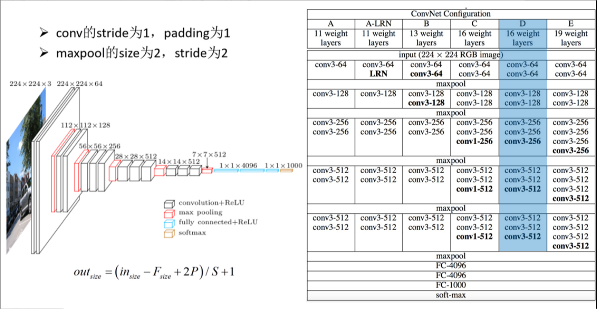
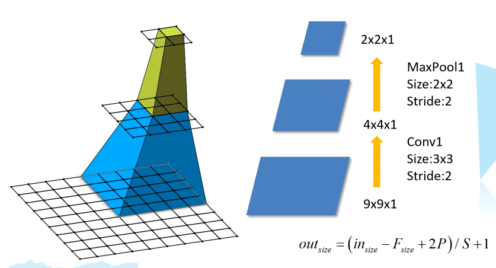
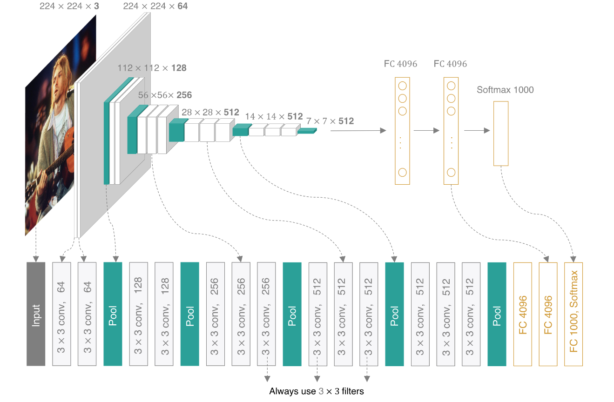
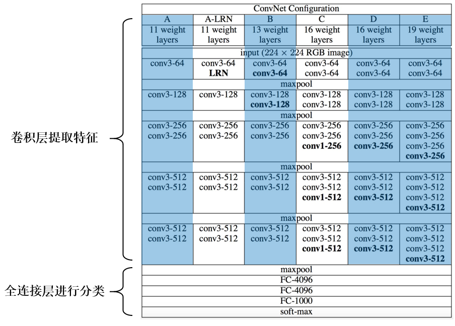

[toc]

# VGG net

## 网络模型

VGG网络有多个版本，一般常用的是VGG-16模型，其网络结构如下如所示：

在原论文中，作者给了6个VGG网络的不同配置，并且尝试了不同的深度（11、13、16、19层）以及是否采用LRN等。在实际使用过程中，我们一般都会采用D这个配置，即16层：13个卷积层以及最后3个全连接层。

## 模型亮点

- **利用小尺寸卷积核等效大尺寸卷积核**，通过堆叠多个 3x3 的卷积核来代替大尺度卷积核（目的：减少所需参数）。在原论文中提到，可以通过堆叠两个 3x3的卷积核替代 5x5 卷积核（使得两个 3x3 的卷积核与 5x5 的卷积核拥有相同的感受野）；堆叠三个 3x3 的卷积核替代 7x7 的卷积核（使得三个 3x3 的卷积核与 7x7 的卷积核拥有相同的感受野）。
- **卷积层均采用相同的卷积核参数**，这样就能够使得每一个卷积层（张量）与前一层（张量）保持相同的宽和高；
- **池化层均采用相同的池化核参数**，池化层采用尺寸为2X2，stride=2，max的池化方式，使得池化后的层尺寸长宽为未池化前的1/2；
- **全连接转卷积**，网络测试阶段将训练阶段的三个全连接替换为三个卷积；

#### 感受野

在卷积神经网络中，决定某一层输出结果中一个元素所对应的输入层的区域大小，被称为感受野。通俗来说就是输出的 feature map 上的一个单元对应输入层上的区域大小。

> 网络层输出特征图上的一个元素点，由原始输入中多大区域映射而来，其感受野就是多大。

 如上图所示，自下向上，输入一个 9 * 9 * 1 的特征图，经过卷积层 Conv1，得到 4 * 4 * 1 大小的第一个输出层，再经过池化层 MaxPool1，得到 2 * 2 * 1 大小的输出层,。那么第二个输出层的一个单元（绿色方块）的感受野就是 2 * 2 大小的区域；第一层输出层的一个单元（蓝色方块）的感受野就是 5 * 5 大小的区域。

感受野计算公式:
$$
\mathrm{F}\left(\mathrm{i}\right)=\left(\mathrm{F}\left(\mathrm{i}+1\right)-1\right)*\mathrm{Stride}+\mathrm{Ksize}
$$

>$F(i)$ 为第 $i$ 层感受野，$Stride$ 为第 $i$ 层的步距，$Ksize$ 为卷积核或池化核的尺寸
>以上图为例：
>
> Feature Map：$\operatorname{F}(3) = 1$ （因为上面没有了，所以是1个单元格）
>            Pool1：$\operatorname{F}\left(2\right)=\left(\operatorname{F}\left(3\right)-1\right)*2+2=2$ 
>           Conv1:  $\mathrm{F}\left(1\right)=\left(\mathrm{F}\left(2\right)-1\right)*2+3=5$ 
>
> Feature map(最后得到的特征图)：F=1
>         Pool1：其输出的是2 * 2大小，其输入的是4 * 4大小，Ksize=2, Stride=2则 F=(1-1) * 2+2=2
>        Conv1：其输出的是4 * 4大小，其输入的是9 * 9大小，Ksize=3, Stride=2则 F=(2-1) * 2+3=5

#### 验证VGG论文中两点结论

**1.堆叠两个3×3的卷积核替代5x5的卷积核，堆叠三个3×3的卷积核替代7x7的卷积核。替代前后感受野是否相同？**

（注：VGG网络中卷积的Stride默认为1）

>Feature Map：$\operatorname{F} = 1$
>Conv3x3(3)：$\mathrm{F}=(1-1)*1+3=3$ （VGG的卷积核默认步长为1，大小为 3 * 3）
>Conv3x3(2)：$\operatorname{F}=(3-1)*1+3=5$ （堆叠两层卷积核，感受野与一个 5 * 5 大小的卷积核是一样的）
>Conv3x3(1)：$\operatorname{F}=\left(5-1\right)*1+3=7$ （堆叠三层卷积核，感受野与一个 7*7 大小的卷积核是一样的）

**2.堆叠3×3卷积核后训练参数是否真的减少了？**

注：CNN参数个数 = 卷积核尺寸×卷积核深度 × 卷积核组数 = 卷积核尺寸 × 输入特征矩阵深度 × 输出特征矩阵深度
现假设 输入特征矩阵深度 = 输出特征矩阵深度 = C

- 使用7×7卷积核所需参数个数： $7\times7\times\mathrm{C}\times\mathrm{C}=49\mathrm{C}^2$
- 堆叠三个3×3的卷积核所需参数个数：$3\times3\times\mathrm C\times\mathrm C+3\times3\times\mathrm C\times\mathrm C+3\times3\times\mathrm C\times=27\mathrm{C}^2$

稍作计算可以发现，经3×3卷积的特征矩阵的尺寸是不改变的：
$$
\text{out~size}=\left(\mathrm{in}_{\mathrm{size}}-\mathrm{F}_{\mathrm{size}}+2\mathrm{P}\right)\big/\mathrm{S}+1=\left(\mathrm{in}_{\mathrm{size}}-3+2\right)\big/1+1=\mathrm{in}_{\mathrm{size}}
$$

## 详细解读

>vgg-16

|   number    |    Input_size     |   output_size   | kernels | kernels_size |
| :---------: | :---------------: | :-------------: | :-----: | :----------: |
|    Conv1    |   [224, 224, 3]   | [224, 224, 64]  |   64    |      3       |
|    Conv2    |  [224, 224, 64]   | [224, 224, 64]  |   64    |      3       |
| MaxPooling1 |  [224, 224, 64]   | [112, 112, 64]  |    \    |      2       |
|    Conv3    |  [112, 112, 64]   | [112, 112, 128] |   128   |      3       |
|    Conv4    |  [112, 112, 128]  | [112, 112, 128] |   128   |      3       |
| MaxPooling2 |  [112, 112, 128]  |  [56, 56, 128]  |    \    |      2       |
|    Conv5    |   [56, 56, 128]   |  [56, 56, 256]  |   256   |      3       |
|    Conv6    |   [56, 56, 256]   |  [56, 56, 256]  |   256   |      3       |
|    Conv7    |   [56, 56, 256]   |  [56, 56, 256]  |   256   |      3       |
| MaxPooling3 |   [56, 56, 256]   |  [28, 28, 256]  |    \    |      2       |
|    Conv8    |   [28, 28, 256]   |  [28, 28, 512]  |   512   |      3       |
|    Conv9    |   [28, 28, 512]   |  [28, 28, 512]  |   512   |      3       |
|   Conv10    |   [28, 28, 512]   |  [28, 28, 512]  |   512   |      3       |
| MaxPooling4 |   [28, 28, 512]   |  [14, 14, 512]  |    \    |      2       |
|   Conv11    |   [14, 14, 512]   |  [14, 14, 512]  |   512   |      3       |
|   Conv12    |   [14, 14, 512]   |  [14, 14, 512]  |   512   |      3       |
|   Conv13    |   [14, 14, 512]   |  [14, 14, 512]  |   512   |      3       |
| MaxPooling5 |   [28, 28, 512]   |   [7, 7, 512]   |    \    |      2       |
|     FC1     | 7 * 7 * 512(展平) |        \        |    \    |     4096     |
|     FC2     |       4096        |        \        |    \    |     4096     |
|     FC3     |       4096        |        \        |    \    |     4096     |

# reference

https://blog.csdn.net/m0_37867091/article/details/107237671

https://blog.csdn.net/Eniac0/article/details/117533531

https://blog.csdn.net/BIgHAo1/article/details/121105934

https://blog.csdn.net/qq_45998041/article/details/114626473

【感受野面试题】https://zhuanlan.zhihu.com/p/54011524

【感受野】https://blog.csdn.net/qq_43665602/article/details/126754736

【★】https://blog.csdn.net/disguise666/article/details/105271503

haha11:40

