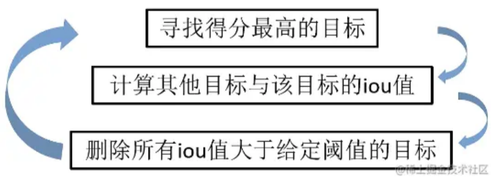

[toc]

# 目标检测原理

## 什么是目标检测

目标检测的任务是找出图像中所有感兴趣的目标（物体），确定他们的类别和位置。

其中，需要识别哪些物体是人为设定限制的，仅识别需要检测的物体；物体的坐标位置由两种表示方法：极坐标表示（xmin, ymin, xmax, ymax）和中心点坐标表示（x_center, y_center, w, h）。

我们要解决的目标检测任务，是一个分类问题和回归问题的叠加，分类是区分目标属于哪个类别，回归用来定位目标所在的位置。

## 目标检测算法的分类

基于深度学习的目标检测算法分为2类：Two Stage和One Stage。

1. Two Stage：先预设一个区域，改区域称为region proposal，即一个可能包含待检测物体的预选框（简称RP），再通过卷积神经网络进行样本分类计算。流程是：特征提取 -> 生成RP -> 分类/回归定位。常见的Two Stage算法有：R-CNN、SPP-Net、Fast R-CNN、Faster R-CNN、R-FCN等。
2. One Stage：不用生成RP，直接在网络中提取特征值来分类目标和定位。流程是：特征提取 -> 分类/回归定位。常见的One Stage算法有：OverFeat、YOLOv1、YOLOv2、YOLOv3、YOLOv5、SSD、RetinaNet等。

## 开山之作~RCNN算法介绍

RCNN是目标检测领域的开山之作，作者Ross Girshick ，我们称之为RGB大神。

接下来将详细介绍介绍RCNN的原理，先来看看论文中这张经典的图片。这张图片展示了RCNN的实现过程，其主要有四步，下面分别对每步进行讲解。

### 1、候选区域生成

**首先用选择性搜索算法（Selective Search,SS）提取候选区域**

候选区域生成在RCNN中采用的是selective search 【简称SS算法】，这个算法的原理大致是通过颜色、大小、形状等一些特征对图像进行聚类，算法的结果是在一张图片中生成一系列的候选框，RCNN中让每张图像都生成2000个候选框。这些候选框有着大量的重叠部分，因此我们后面需要将这些重叠的候选框去除，得到相对准确的候选框。

> ss算法：
>
> 首先将每个像素作为一组。然后，计算每一组的纹理，并将两个最接近的组结合起来。但是为了避免单个区域吞噬其他区域，我们首先对较小的组进行分组。我们继续合并区域，直到所有区域都结合在一起。下图第一行展示了如何使区域增长，第二行中的蓝色矩形代表合并过程中所有可能的 ROI。
>
> 
>
> SelectiveSearch在一张图片上提取出来约2000个侯选区域，**需要注意的是这些候选区域的长宽不固定**。 而使用CNN提取候选区域的特征向量，需要接受固定长度的输入，所以不能直接输入AlexNet中，需要对候选区域做一些尺寸上的修改。
>
> 大小统一使用的方法是Crop+Wrap方法

下图展示了SS算法得到的大致结果，可见一个目标会有多个候选框生成。

**RCNN中SS算法每幅图像生成的候选框个数为2000**

因为使用Alexnet网络提取特征，输入大小需要resize到227×227

### 2、神经网络提取特征

**使用深度卷积神经网络提取每一个候选区的深度特征**

在侯选区域的基础上提取出更高级、更抽象的特征，这些高级特征是作为下一步的分类器、回归的输入数据。

上一步我们由SS算法从一张图片中得到了2000个候选框，接下来需要对这些候选框进行特征提取，即分别将2000个候选框区域喂入ALexNet网络进行训练，提取特征。

#### Alexnet网络

AlexNet网络结构相对简单，使用了8层卷积神经网络，前5层是卷积层，剩下的3层是全连接层，具体如下所示。

从上图看，在网络设计上其实并非如上图所示，上图包含了GPU通信的部分。这是由当时GPU内存的限制引起的，作者使用两块GPU进行计算，因此分为了上下两部分。但是，以目前GPU的处理能力，单GPU足够了，因此其结构图可以如下所示：

---

**注意：**

- 原作者实验时用了两块GPU并行计算，上下两组图的结构是一样的；
- 原图输入224 × 224，实际上进行了随机裁剪，实际大小为227 × 227。

---

网络细化图

这里是设定输入是 `227 * 227`

需要注意的是，在RCNN中，我们不需要最后的softmax层，只需要经过最后两次全连接层，利用其提取到的特征即可。此外由于全连接层的存在，需要对输出图片的尺寸进行限制，即需要图片分辨率为227 * 227。论文中所采用的方法为无论候选区域的大小或纵横比如何，先将其周围扩展16个邻近像素，然后将所有像素强制缩放至227 * 227尺寸。 

提取的这些特征将会保存在磁盘当中（**这些提取的特征才是真正的要训练的数据**）

### 3、SVM分类器分类

**训练SVM分类器来对这些特征进行分类**

上一步我们已经通过ALexNet网络提取到特征，每一个候选框区域都会生成4096维的特征向量，如下图所示：

上图展示的是一个候选框提取到的特征，我们采用SS算法会从一幅图片中生成2000个候选框，将所有候选框输入网络，就会得到2000 * 4096维的特征矩阵。将2000 * 4096维的特征矩阵与20个SVM组成的权值矩阵4096 * 20相乘，会得到2000 * 20维的概率矩阵，其中每一行代表一个候选框属于各个目标类别的概率。 **【注意：若采用的是VOC数据集，那么类别是应该有21类，包括一个背景类】**

从上图可以看出，2000 * 20维矩阵的每一列表示2000个候选框分别对某一类的预测概率，如第一列则表示2000个候选框分别对狗的预测概率。**我们对每一列即每一类进行非极大值抑制（NMS）用于剔除重叠候选框，得到该列中得分最高的的建议框。** 具体NMS过程如下：

假设一张图片的2000个侯选区域，那么提取出来的就是2000 x 4096这样的特征向量（R-CNN当中默认CNN层输出4096特征向量）。那么最后需要对这些特征进行分类，R-CNN选用SVM进行二分类。假设检测N个类别，那么会提供20个不同类别的SVM分类器，每个分类器都会对2000个候选区域的特征向量分别判断一次，这样得出[2000, 20]的得分矩阵，如下图所示：

R-CNN选用SVM进行二分类。假设检测20个类别，那么会提供20个不同类别的SVM分类器，每个分类器都会对2000个候选区域的特征向量分别判断一次，这样得出[2000, 20]的得分矩阵，如下图所示

2000个候选区域，每个候选区域都有20个分类结果

* 每个SVM分类器做的事情
  * 判断2000个候选区域是**某类别，还是背景**

#### 非最大抑制（NMS）

* 目的

  * **筛选候选区域，目标是一个物体（图片当中真是的被标记的物体）只保留一个最优的框，来抑制那些冗余的候选框**

* 迭代过程

  * 1、对于所有的2000个候选区域得分进行概率筛选，0.5 （svm得出概率小于0.5的全部删除）

  * 2、剩余的候选框

    * 假设图片真实物体个数为2（N），筛选之后候选框为5（P），计算N中每个物体位置与所有P的交并比IoU计算，得到P中每个候选框对应IoU最高的N中一个
    * 如下图，A、C候选框对应左边车辆，B、D、E对应右边车辆
    * 

    假设现在滑动窗口有：A、B、C、D、E 5个候选框，

    * 第一轮：对于右边车辆，假设B是得分最高的，与B的IoU＞0.5删除。现在与B计算IoU，DE结果＞0.5，剔除DE，B作为一个预测结果
    * 第二轮：对于左边车辆，AC中，A的得分最高，与A计算IoU，C的结果＞0.5，剔除C，A作为一个结果

    最终结果为在这个5个中检测出了两个目标为A和B**（A和B框的位置选择性搜索算法的出来的）**

    

    *SS算法得到的物体位置已经固定了，但是我们筛选出的位置不一定真的就特别准确，需要对A和B进行最后的修正**

  

### 4、回归器修正候选框位置

**最后通过边界回归算法重新定位目标边界框**

上一步骤中我们剔除了许多候选框，接下来我们需要对剩余的候选框进一步筛选，即分别用20个回归器对上述20个类别中剩余的候选框进行回归操作，最终得到每个类别修正后的得分最高的bounding box。

修正过程（线性回归）

G 是ground_true

A 是候选框

A与G做回归训练，不断的和G吻合，G' 是变化过程

####  两种Bounding box名称

在目标检测当中，对bbox主要由两种类别。

- Ground-truth bounding box（GTbox）：图片当中真实标记的框 （图中绿色的）
- Predicted bounding box：预测的时候标记的框（图中红色的）

一般在目标检测当中，我们预测的框有可能很多个，真实框GT也有很多个。

####  IoU交并比

| 任务                                               | description                                            | 输入         | 输出                                          | 评价标准                      |
| -------------------------------------------------- | ------------------------------------------------------ | ------------ | --------------------------------------------- | ----------------------------- |
| Detection     and     Localization    (检测和定位) | 在输入图片中找出存在的物体类别和位置(可能存在多种物体) | 图片(image ) | 类别标签(categories)和    位置(bbox(x,y,w,h)) | IoU (Intersection over Union) |

IoU（交并比）--位置的考量

- 两个区域的重叠程度overlap：侯选区域和标定区域的IoU值

  

  通常Correct: 类别正确 且 IoU > 0.5

  

## 总结：

