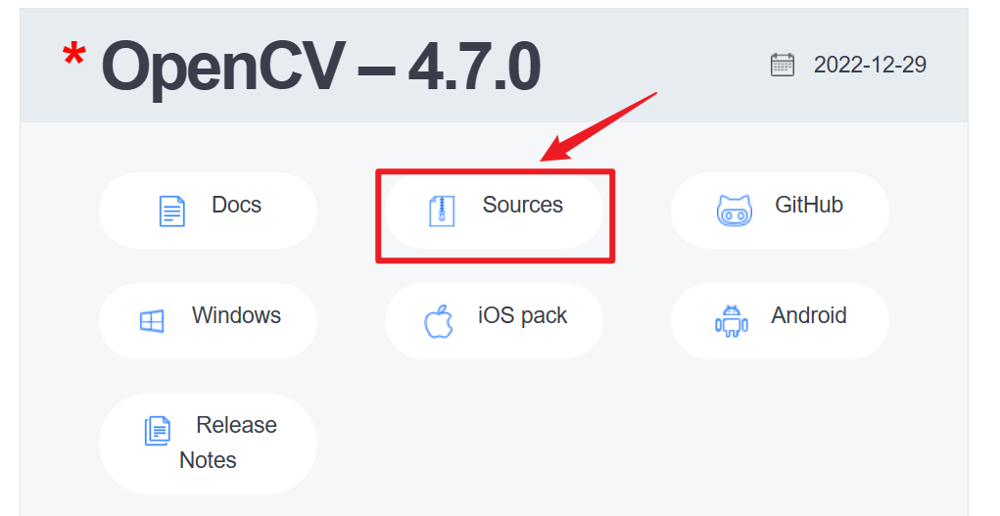

## 一、从 Ubuntu 源仓库安装 OpenCV

**Python安装方式**

OpenCV 在 Ubuntu 20.04 软件源中可用。想要安装它，运行：

```
sudo apt update
sudo apt install libopencv-dev python3-opencv
```

上面的命令将会安装所有必要的软件包，来运行 OpenCV：

通过导入`cv2`模块，并且打印 OpenCV 版本来验证安装结果：

```
python3 -c "import cv2; print(cv2.__version__)"
```


## 二、 从源码安装 OpenCV

从源码安装OpenCV可以允许你安装最新可用的版本。它还将针对你的特定系统进行优化，并且你可以完整控制所有的构建选项。这是最推荐的安装 OpenCV 的方式。

## 安装基本工具

确保Ubuntu上有安装过程中使用到的一些工具，如果没有，请输入以下指令安装：

```
sudo apt install -y g++
sudo apt install -y cmake
sudo apt install -y make
sudo apt install -y wget unzip
```

输入 -V / --version / -v 查看版本信息：


需要安装 cmake


## step1：安装cmake

执行以下命令安装最新的cmake

```
sudo apt-get update
sudo apt-get upgrade
sudo apt-get install build-essential cmake
```

## step2：[安装opencv](https://so.csdn.net/so/search?q=安装opencv&spm=1001.2101.3001.7020)依赖项

```
sudo apt-get install build-essential libgtk2.0-dev libavcodec-dev libavformat-dev libjpeg-dev libswscale-dev libtiff5-dev
sudo apt-get install libcanberra-gtk-module
sudo apt-get install pkg-config
```

## step3：下载opencv

https://opencv.org/releases/



## step4：解压并新建【build】文件夹

1. 将下载的文件【opencv-4.7.0.zip】解压到需要安装的目录，解压后会得到【opencv-4.7.0】文件夹。

2. 打开【opencv-4.7.0】文件夹，并新建build文件夹。

（我是装在/opt目录下）

```
unzip -n opencv-4.7.0.zip -d /opt
# 将压缩文件opencv-4.7.0.zip在指定目录/opt下解压缩，如果已有相同的文件存在，要求unzip命令不覆盖原先的文件。
```


## 三、安装opencv

## step1：编译opencv

打开刚才新建的build文件夹，并在该文件夹路径下执行以下命令：

```
# 需要提前退出conda环境，不然会有包冲突
      
不要慌，问题不大，你安装的conda与opencv冲突了，退出conda即可：
conda deactivate
并且在.bashrc中注释掉conda的环境变量
#export PATH="~/anaconda3/bin":$PATH
#source ~/anaconda3/bin/activate
注释掉之后记得保存生效：source .bashrc

# 然后使用下面的命令进行编译
cmake -D CMAKE_BUILD_TYPE=Release -D CMAKE_INSTALL_PREFIX=/usr/local .. 
解释:
其中第一行最后的[空格+..]一定不能省。其含义是告诉编译器将要编译的文件是来自上一层文件夹的CMakeList.txt文件。

# 如果仍然有提示anaconda包冲突，可以重启一下服务器。
 
# 输出将会如下,则成功
-- Configuring done
-- Generating done
-- Build files have been written to: /opt/opencv-4.7.0/build

```

```
#  开始编译，依然是在build文件夹下
sudo make -j3 # 此电脑CPU共有4个核心
解释
其中4表示用4个线程同时编译，使用命令nproc查看cpu的核心数量，尽量不要用所有核心做编译，不然你会卡的痛不欲生。在经过漫长的等待后，看到如下画面说明编译完成了。
```


安装opencv。

```
sudo make install
# 源码编译和安装就完成啦~
```

## step2：配置opencv在ubuntu的参数

1. 打开ld.so.conf文件(文件可能为空白，不用管他)，并在文件末尾加上一行内容【/usr/local/lib】

```
sudo vi /etc/ld.so.conf
```

2. 加载配置，使刚才添加的内容生效。

```
sudo ldconfig
```

3. 打开bash.bashrc文件，在文件末尾添加以下两行内容：

```
sudo gedit /etc/bash.bashrc 

PKG_CONFIG_PATH=$PKG_CONFIG_PATH:/usr/local/lib/pkgconfig
export PKG_CONFIG_PATH
```

4. 运行bash.bashrc：

```
source /etc/bash.bashrc
```

5. 更新系统的配置环境

```
# 需要先 apt-get install mlocate
sudo updatedb
```

6. 创建并配置opencv.pc文件

```
cd /usr/local/lib
mkdir pkgconfig
cd pkgconfig
touch opencv.pc
sudo gedit opencv.pc
```

打开文件后，添加以下内容并保存关闭文件：

**注意：我这里装的是opencv4.7.0，如果安装的是别的版本，Version属性需要修改为对应的版本号.**

```
prefix=/usr/local
exec_prefix=${prefix}
includedir=/usr/local/include
libdir=/usr/local/lib
 
Name: OpenCV
Description: Open Source Computer Vision Library
Version: 4.7.0
Libs: -L${exec_prefix}/lib -lopencv_stitching -lopencv_superres -lopencv_videostab -lopencv_aruco -lopencv_bgsegm -lopencv_bioinspired -lopencv_ccalib -lopencv_dnn_objdetect -lopencv_dpm -lopencv_face -lopencv_photo -lopencv_freetype -lopencv_fuzzy -lopencv_hdf -lopencv_hfs -lopencv_img_hash -lopencv_line_descriptor -lopencv_optflow -lopencv_reg -lopencv_rgbd -lopencv_saliency -lopencv_stereo -lopencv_structured_light -lopencv_phase_unwrapping -lopencv_surface_matching -lopencv_tracking -lopencv_datasets -lopencv_text -lopencv_dnn -lopencv_plot -lopencv_xfeatures2d -lopencv_shape -lopencv_video -lopencv_ml -lopencv_ximgproc -lopencv_calib3d -lopencv_features2d -lopencv_highgui -lopencv_videoio -lopencv_flann -lopencv_xobjdetect -lopencv_imgcodecs -lopencv_objdetect -lopencv_xphoto -lopencv_imgproc -lopencv_core
Libs.private: -ldl -lm -lpthread -lrt
Cflags: -I${includedir}
```

7. 检查opencv安装情况：

```
pkg-config opencv --modversion
如果安装成功，会有返回版本号：
4.7.0
```


## 四、用cmake尝试编译opencv例程序

step1：新建一个文件夹，并创建以下两个文件：

**CMakeLists.txt**

```
cmake_minimum_required(VERSION 2.6)
# create proj
project(testopencv)
# c++ 11
set(CMAKE_CXX_FLAGS "-std=c++11")
 
find_package(OpenCV 4.7.0 REQUIRED) 	# find opencv4.7 installed path
include_directories(OpenCV_INCLUDE_DIRS)	# load opencv header files
add_executable(testopencv main.cpp)	# create exe file
target_link_libraries(testopencv ${OpenCV_LIBS})	# link llib files to exe
```

**main.cpp**

```
# include <iostream>
# include <opencv2/opencv.hpp>
 
using namespace std;
using namespace cv;
 
int main(){
	Mat img=imread("dog.jpg");
	imshow("test", img);
	waitKey(0);
	return 0;
}
```

step2：在该文件夹内随便放一张图片，命名为【dog.jpg】

step3：**在该文件夹目录下**执行以下命令：

```
cmake .
make
```

编译后，会在同路径下生成一堆文件，其中有一个名为【testopencv】的可执行文件。

step4：执行以下命令运行可执行文件，会打开刚才的dog.jpg文件。

```
./testopencv
```

注意：路径【./】不可省，否则linux会以为这是一个系统命令。

**至此，整个opencv安装测试过程完毕。**

# Reference

https://blog.csdn.net/wxyczhyza/article/details/128968849

https://devpress.csdn.net/gitcode/6405a902986c660f3cf912cb.html

https://www.rstk.cn/news/611477.html

http://www.manongjc.com/detail/29-linnrlcvsmywouu.html

https://blog.csdn.net/wss794/article/details/124850094

