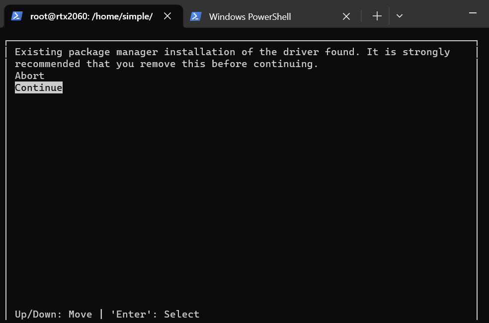
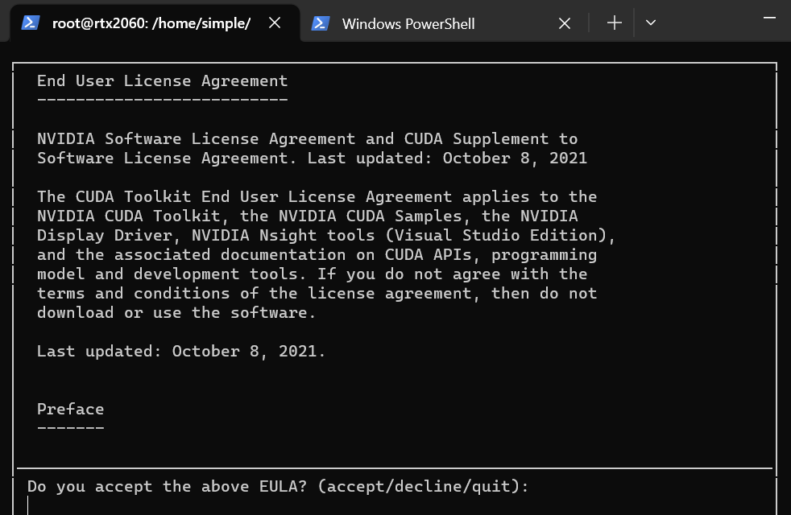
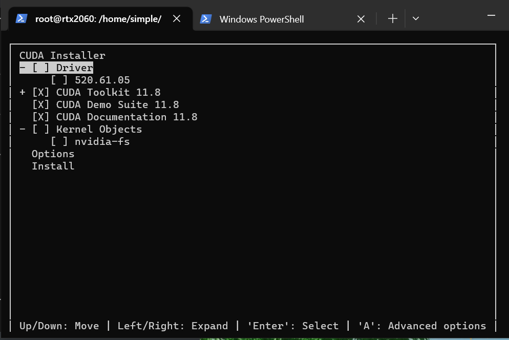
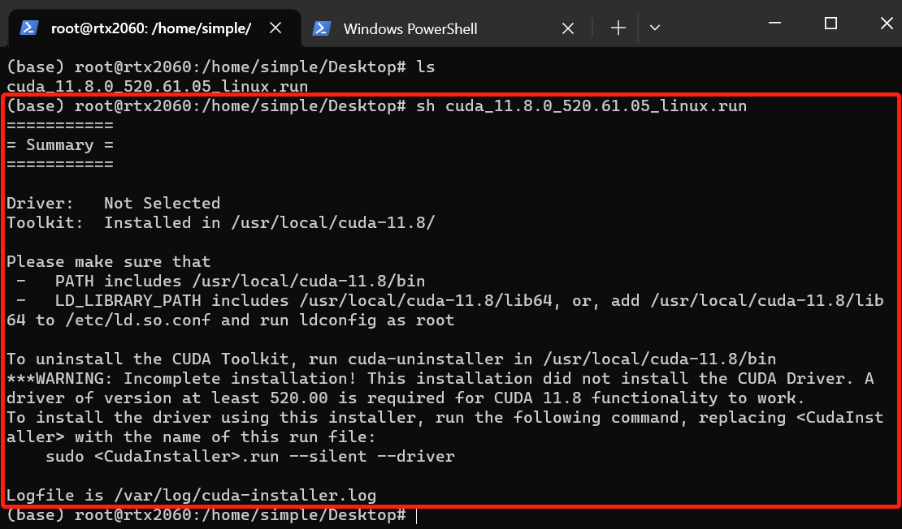
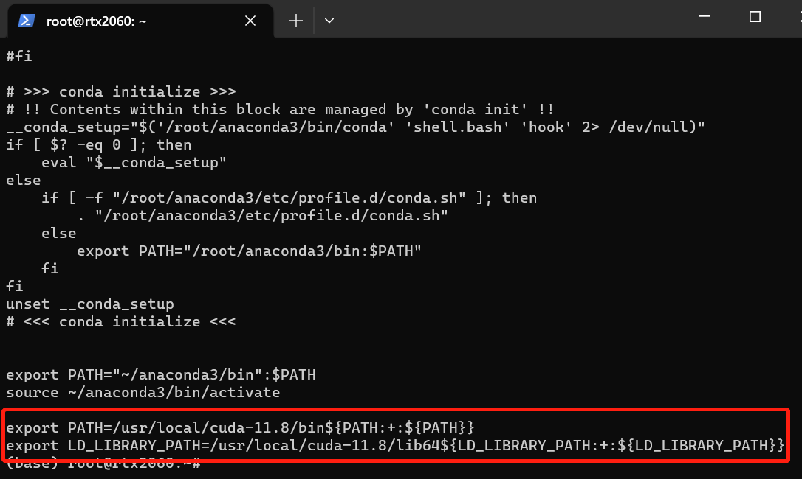
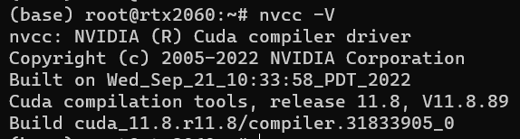
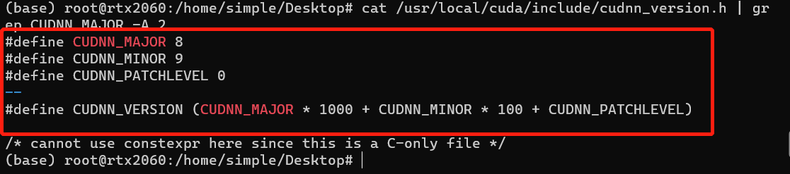

cuda 版本和显卡驱动版本之间的对应关系

https://docs.nvidia.com/cuda/cuda-toolkit-release-notes/index.html

# CUDA文件下载地址

https://developer.nvidia.com/cuda-toolkit-archive
选择合适自己电脑的版本进行下载，下载命令如下：

```
wget https://developer.download.nvidia.com/compute/cuda/11.8.0/local_installers/cuda_11.8.0_520.61.05_linux.run
```

下载完成后进行安装，安装命令如下：

```
sudo sh cuda_11.8.0_520.61.05_linux.run
```

运行上面指令后，会弹出如下界面，移动到Continue，然后按Enter



输入accept



移动到“Driver”，按下空格，以取消安装驱动（即使没装CUDA前，你的电脑之前也是有GPU驱动的，不需要再装）。再点击“Install”



接下来就会自动安装了，等待大概5分钟左右。

**注意：一定要取消Driver和520.61.05的安装否则会安装失败；**

安装完成后，显示如下：



在~/.bashrc文件中添加如下环境变量：

> 官方参考文档：https://docs.nvidia.com/cuda/cuda-quick-start-guide/index.html#id8

```
 # 进入.bashrc文件
 vi ~/.bashrc
 
 # 在文件的末尾加入下面两行：
export PATH=/usr/local/cuda-11.8/bin${PATH:+:${PATH}}
export LD_LIBRARY_PATH=/usr/local/cuda-11.8/lib64${LD_LIBRARY_PATH:+:${LD_LIBRARY_PATH}}
```

如下图



更新系统环境变量

```shell
source ~/.bashrc
```


至此cuda安装完成，输入nvcc -V命令查看cuda信息

```
nvcc -V
```




# cudnn 安装

cudnn的下载地址：https://developer.nvidia.com/rdp/cudnn-archive
根据自己的需要下载合适的版本。

- 解压

```
sudo tar -xvf cudnn-linux-x86_64-8.9.0.131_cuda11-archive.tar.xz
```

- 复制移动部分文件

```
sudo cp cudnn-linux-x86_64-8.9.0.131_cuda11-archive/include/cudnn.h /usr/local/cuda/include
sudo cp cudnn-linux-x86_64-8.9.0.131_cuda11-archive/lib/libcudnn* /usr/local/cuda/lib64

sudo chmod a+r /usr/local/cuda/include/cudnn.h /usr/local/cuda/lib64/libcudnn*

```

注意一下:cudnn8.0以上会将版本信息更新到cudnn_version.h文件中,也需要将这个文件复制,否则验证的时候会没有反应

```
sudo cp cudnn-linux-x86_64-8.9.0.131_cuda11-archive/include/cudnn_version.h /usr/local/cuda/include
```

### 验证

```
cat /usr/local/cuda/include/cudnn_version.h | grep CUDNN_MAJOR -A 2
```



如果出现以上现象就说明安装成功。


# 安装TensorRT

>官方教程：https://docs.nvidia.com/deeplearning/tensorrt/install-guide/index.html#installing-tar
>
>参考教程：https://www.exyb.cn/news/show-146536.html

我把TensorRT安装在了`/usr/local`下

```shell
cd ~/Downloads
sudo tar -xzvf TensorRT-8.6.1.6.Linux.x86_64-gnu.cuda-11.8.tar.gz -C /usr/local/
```

配置环境变量

```shell
vim ~/.bashrc
```

在`.bashrc`文件最后一行增加路径

```c
export LD_LIBRARY_PATH=$LD_LIBRARY_PATH:/usr/local/TensorRT-8.6.1.6/lib
```

配置生效

```shell
source ~/.bashrc
```

编译TensorRT的示例，会在`bin`路径下生成一个针对MINIST数据集的`sample_mnist`可执行文件

```shell
cd /usr/local/TensorRT-8.6.1.6/samples/sampleOnnxMNIST
sudo make
cd ../../bin/
./sample_onnx_mnist

# 成功运行的提示
(base) root@rtx2060:/usr/local/TensorRT-8.6.1.6/bin# ./sample_onnx_mnist
&&&& RUNNING TensorRT.sample_onnx_mnist [TensorRT v8601] # ./sample_onnx_mnist
[06/13/2023-23:12:28] [I] Building and running a GPU inference engine for Onnx MNIST
[06/13/2023-23:12:28] [I] [TRT] [MemUsageChange] Init CUDA: CPU +210, GPU +0, now: CPU 215, GPU 322 (MiB)
[06/13/2023-23:12:35] [I] [TRT] [MemUsageChange] Init builder kernel library: CPU +740, GPU +174, now: CPU 1031, GPU 496 (MiB)
[06/13/2023-23:12:35] [W] [TRT] CUDA lazy loading is not enabled. Enabling it can significantly reduce device memory usage and speed up TensorRT initialization. See "Lazy Loading" section of CUDA documentation https://docs.nvidia.com/cuda/cuda-c-programming-guide/index.html#lazy-loading
[06/13/2023-23:12:35] [I] [TRT] ----------------------------------------------------------------
[06/13/2023-23:12:35] [I] [TRT] Input filename:   ../../../data/mnist/mnist.onnx
[06/13/2023-23:12:35] [I] [TRT] ONNX IR version:  0.0.3
[06/13/2023-23:12:35] [I] [TRT] Opset version:    8
[06/13/2023-23:12:35] [I] [TRT] Producer name:    CNTK
[06/13/2023-23:12:35] [I] [TRT] Producer version: 2.5.1
[06/13/2023-23:12:35] [I] [TRT] Domain:           ai.cntk
[06/13/2023-23:12:35] [I] [TRT] Model version:    1
[06/13/2023-23:12:35] [I] [TRT] Doc string:
[06/13/2023-23:12:35] [I] [TRT] ----------------------------------------------------------------
[06/13/2023-23:12:35] [W] [TRT] onnx2trt_utils.cpp:374: Your ONNX model has been generated with INT64 weights, while TensorRT does not natively support INT64. Attempting to cast down to INT32.
[06/13/2023-23:12:35] [I] [TRT] BuilderFlag::kTF32 is set but hardware does not support TF32. Disabling TF32.
[06/13/2023-23:12:35] [I] [TRT] Graph optimization time: 0.000741664 seconds.
[06/13/2023-23:12:35] [I] [TRT] BuilderFlag::kTF32 is set but hardware does not support TF32. Disabling TF32.
[06/13/2023-23:12:35] [I] [TRT] Local timing cache in use. Profiling results in this builder pass will not be stored.
[06/13/2023-23:12:36] [I] [TRT] Detected 1 inputs and 1 output network tensors.
[06/13/2023-23:12:36] [I] [TRT] Total Host Persistent Memory: 24928
[06/13/2023-23:12:36] [I] [TRT] Total Device Persistent Memory: 0
[06/13/2023-23:12:36] [I] [TRT] Total Scratch Memory: 0
[06/13/2023-23:12:36] [I] [TRT] [MemUsageStats] Peak memory usage of TRT CPU/GPU memory allocators: CPU 0 MiB, GPU 4 MiB
[06/13/2023-23:12:36] [I] [TRT] [BlockAssignment] Started assigning block shifts. This will take 6 steps to complete.
[06/13/2023-23:12:36] [I] [TRT] [BlockAssignment] Algorithm ShiftNTopDown took 0.019236ms to assign 3 blocks to 6 nodes requiring 32256 bytes.
[06/13/2023-23:12:36] [I] [TRT] Total Activation Memory: 31744
[06/13/2023-23:12:36] [I] [TRT] [MemUsageChange] TensorRT-managed allocation in building engine: CPU +0, GPU +4, now: CPU 0, GPU 4 (MiB)
[06/13/2023-23:12:36] [I] [TRT] Loaded engine size: 1 MiB
[06/13/2023-23:12:36] [I] [TRT] [MemUsageChange] TensorRT-managed allocation in engine deserialization: CPU +0, GPU +0, now: CPU 0, GPU 0 (MiB)
[06/13/2023-23:12:36] [I] [TRT] [MemUsageChange] TensorRT-managed allocation in IExecutionContext creation: CPU +0, GPU +0, now: CPU 0, GPU 0 (MiB)
[06/13/2023-23:12:36] [W] [TRT] CUDA lazy loading is not enabled. Enabling it can significantly reduce device memory usage and speed up TensorRT initialization. See "Lazy Loading" section of CUDA documentation https://docs.nvidia.com/cuda/cuda-c-programming-guide/index.html#lazy-loading
[06/13/2023-23:12:36] [I] Input:
[06/13/2023-23:12:36] [I] @@@@@@@@@@@@@@@@@@@@@@@@@@@@
@@@@@@@@@@@@@@@@@@@@@@@@@@@@
@@@@@@@@@@@@@@@@@@@@@@@@@@@@
@@@@@@@@@@@@@@@@@@@@@@@@@@@@
@@@@@@@@@@@@@@@@@@@@@@@@@@@@
@@@@@@@@@@=   ++++#++=*@@@@@
@@@@@@@@#.            *@@@@@
@@@@@@@@=             *@@@@@
@@@@@@@@.   .. ...****%@@@@@
@@@@@@@@: .%@@#@@@@@@@@@@@@@
@@@@@@@%  -@@@@@@@@@@@@@@@@@
@@@@@@@%  -@@*@@@*@@@@@@@@@@
@@@@@@@#  :#- ::. ::=@@@@@@@
@@@@@@@-             -@@@@@@
@@@@@@%.              *@@@@@
@@@@@@#     :==*+==   *@@@@@
@@@@@@%---%%@@@@@@@.  *@@@@@
@@@@@@@@@@@@@@@@@@@+  *@@@@@
@@@@@@@@@@@@@@@@@@@=  *@@@@@
@@@@@@@@@@@@@@@@@@*   *@@@@@
@@@@@%+%@@@@@@@@%.   .%@@@@@
@@@@@*  .******=    -@@@@@@@
@@@@@*             .#@@@@@@@
@@@@@*            =%@@@@@@@@
@@@@@@%#+++=     =@@@@@@@@@@
@@@@@@@@@@@@@@@@@@@@@@@@@@@@
@@@@@@@@@@@@@@@@@@@@@@@@@@@@
@@@@@@@@@@@@@@@@@@@@@@@@@@@@

[06/13/2023-23:12:36] [I] Output:
[06/13/2023-23:12:36] [I]  Prob 0  0.0000 Class 0:
[06/13/2023-23:12:36] [I]  Prob 1  0.0000 Class 1:
[06/13/2023-23:12:36] [I]  Prob 2  0.0000 Class 2:
[06/13/2023-23:12:36] [I]  Prob 3  0.0000 Class 3:
[06/13/2023-23:12:36] [I]  Prob 4  0.0000 Class 4:
[06/13/2023-23:12:36] [I]  Prob 5  1.0000 Class 5: **********
[06/13/2023-23:12:36] [I]  Prob 6  0.0000 Class 6:
[06/13/2023-23:12:36] [I]  Prob 7  0.0000 Class 7:
[06/13/2023-23:12:36] [I]  Prob 8  0.0000 Class 8:
[06/13/2023-23:12:36] [I]  Prob 9  0.0000 Class 9:
[06/13/2023-23:12:36] [I]
&&&& PASSED TensorRT.sample_onnx_mnist [TensorRT v8601] # ./sample_onnx_mnist

```

# Reference:

https://www.exyb.cn/news/show-146536.html

https://blog.csdn.net/xp_fangfei/article/details/130428022

https://blog.csdn.net/weixin_45080292/article/details/129338338