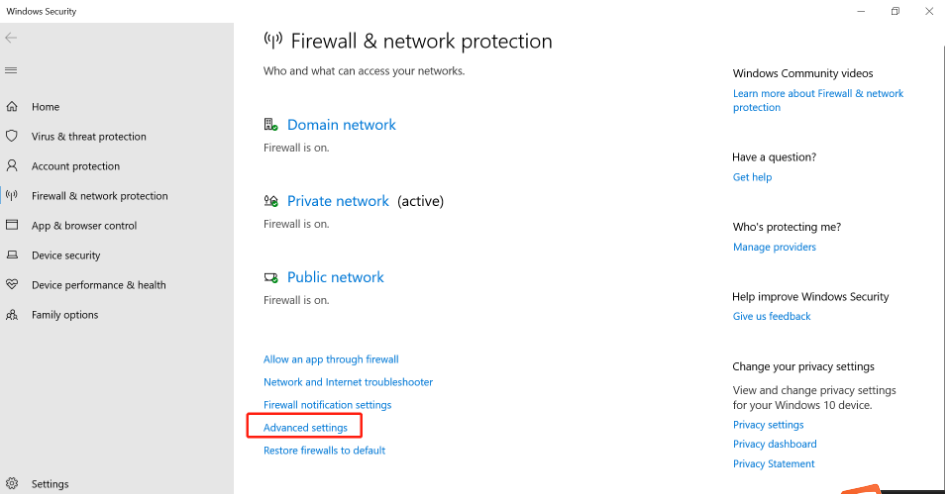
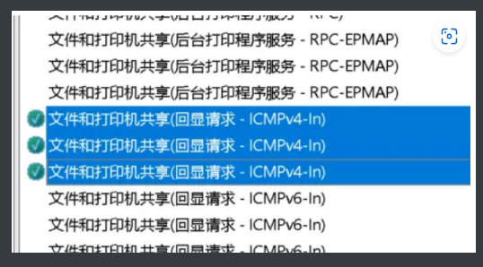

Ubuntu ping不通win就是win打开了防火墙，需要启用以下功能：

【1】右键单击屏幕右下角Internet访问 --》打开“网络和Internet”设置。
【2】Windows防火墙设置 --》 高级设置。
【3】双击入站规则 --》 找到  文件和打印机共享(回显请求 - ICMPv4-In)
【4】双击文件和打印机共享(回显请求 - ICMPv4-In) --》常规–》打钩已启用
【5】应用 --》 确定 --》 关闭

