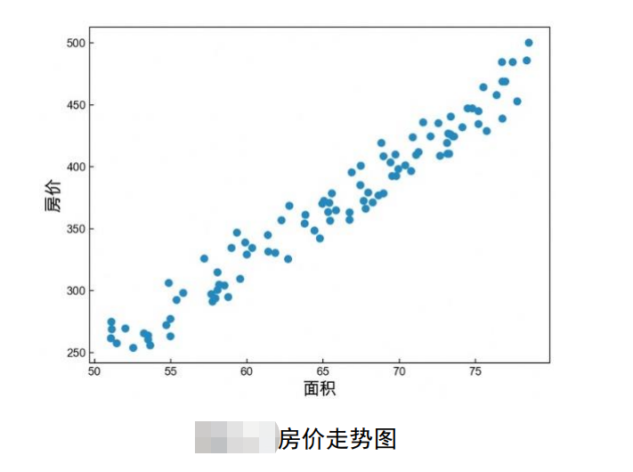
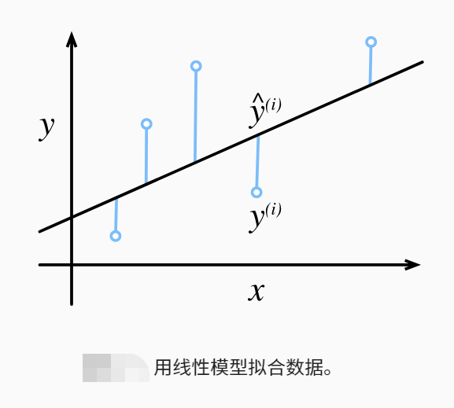
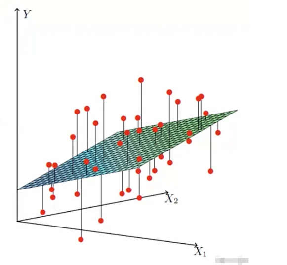

# 线性回归(LinearRegression)

## 一元线性回归

$$
\hat{y}=h(x)=wx+b
$$
其中 $w$ 叫权重参数（Weight）， $b$ 叫偏置（Bias）或者截距（Intercept）。当求解得到未 知参数 $w, b$ 之后，也就意味着我们得到了这个预测模型，即给定一个房屋面积 $x $，就能够预 测出其对应的房价。

---

注意：在机器学习中所谓的模型，可以简单理解为一个函数。

---

通过计算每个样本的真实房价与预测房价之 间的均方误差来精准求得 $w, b$ 的值；
$$
\begin{cases}J(w,b)=\frac{1}{2m}\sum\limits_{i=1}^{m}\left(y^{(i)}-\hat{y}^{(i)}\right)^{2}\\ \hat{y}^{(i)}=h(x^{(i)})=wx^{(i)}+b\end{cases}
$$
其中， $m$ 表示样本数数量；$x^{(i)}$ 表示第 $i$ 个样本的数值，也就是第 $i$ 个房屋的面积； $y^{(i)}$ 表示 第 $i$ 个房屋的真实价格；$\hat{y}^{(i)}$ 表示第 $i$ 个房屋的预测价格。

当函数 $J(w, b)$ 取最小值时的参数 ${\hat{\mathbf{w}}}, {\hat{\boldsymbol{b}}}$ ，就是要求的目标参数。为什么？ 因为当$J(w, b)$取最小值就意味着此时所有样本的预测值与真实值之间的误差（Error）最小。 如果极端一点，那就是所有预测值都等同于真实值，此时的$J(w, b)$ 就等于 0 了。 因此，对于如何求解模型 $h(x)$ 的问题就转换成了如何最小化函数 $J(w, b)$ 的问题。而 $J(w, b)$  也有一个专门的术语叫**目标函数**（Objective Function）或者是**代价函数**（Cost Function） 亦或是**损失函数**。

### Reference

https://mp.weixin.qq.com/s?__biz=MzAwNjU0NjA3Ng==&mid=2247499276&idx=1&sn=5a42c364064a43a55262a96948d9eae4&chksm=9b0909ffac7e80e9965cb439279bf528ffa576e692cc412df7220137f9ef544b45e1cfb6e112&scene=178&cur_album_id=2815601982404132867&rd2werd=1&key=6c102fdf7f6d3fd68e1a3f92464746c3f1c1fdb4bbf94fa3ef543a050f0a11a7358257b2d884d1926b61a4b98d078ebc4d31ec988d27196ecdbfd7ecb9f9473fa552cb1a156c63b486fc14836c342d420f10fcc583e84a11a836db4d03b65b2fd75785a91ed34f64207baad4c8f7e294fe984e9e0c9aab0241c2fed0d95fd891&ascene=14&uin=MTk4NDUwMDExMQ%3D%3D&devicetype=Windows+10+x64&version=6309021a&lang=zh_CN&session_us=gh_07fa40c57c3b&countrycode=CN&exportkey=n_ChQIAhIQjjX%2BQdO89U3hmO%2FFmQ9bIRLvAQIE97dBBAEAAAAAAB1bOIsZMO0AAAAOpnltbLcz9gKNyK89dVj0GbRyVrupz2aIThij5iJ4mRy3k%2BDibDN7betSI%2B2dKU7Vjq%2BCL0BJiD8oHWAHaZBbZOmt4aF84m3DjQ8Fm6vseBdnZBC2ef%2BTZwzhJ7pPi%2B65LQt%2FpZ6pG%2FuyZcv%2Fz6Udu%2Be3H9i3PO93YrBbsINUs5lVgHF2IoQO6Gx0EHk1npGS5H14XM3qyIX5CJiO9Zu%2F79gJSOglxFaOlvHOOzoDzwyi%2BW4CuY%2FrRDl9recmRvHlxorD46KHmaMOGYgGi9RrQpsmZVnMEkkK&acctmode=0&pass_ticket=AHCUoYUtqCnckQqNog31XDFYXIBZtLT%2FYztCkFJc9ODd644RLseRq36Pauewbo6j2xDalbhM%2BJ04yCUF3gzlqA%3D%3D&wx_header=1&fontgear=2

https://zh.d2l.ai/chapter_linear-networks/linear-regression.html

https://zhuanlan.zhihu.com/p/80887841

## 多元线性回归

以波士顿房价数据集为例，其一共包含了 13 个特征属性。因此可以得到如下线性模型;
$$
h(x)=w_1x_1+\cdots+w_{13}x_{13}+b
$$
目标函数为:
$$
\left\{\begin{array}{l}{{J(W,b)=\frac{1}{2m}\sum_{i=1}^{m}\left(y^{(i)}-\hat{y}^{(i)}\right)^{2}}}\\ {{\hat{y}^{(i)}=h(x^{(i)})=w_{1}x_{1}^{(i)}+\cdots+w_{13}x_{13}^{(i)}+b}}\end{array}\right.
$$
其中 $x_{j}^{(i)}$ 表示第 $i$ 个样本的第 $j$ 个特征属性， $W$ 为一个向量表示所有的权重， $b$ 为一个 标量表示偏置。

只要通过某种方法最小化目标函数 $J(w, b)$ 后，便可以求解出模 型对应的参数。

**使用向量来表达**
$$
y=w_1x_1+w_2x_2+\cdots+w_nx_n+b=[w_1 w_2\cdots w_n]\begin{bmatrix}x_1\\x_2\\ \vdots\\ x_n\end{bmatrix}+b
$$
则可以统一形式为:
$$
y=\sum_{i=1}^{n}w_{i}x_{i}+b=\mathbf{w}^{T}\mathbf{x}+b
$$

>y 是预测函数
>
>w 是模型参数
>
>x 是特征输入
>
>b 是偏置项

### Reference

https://zhuanlan.zhihu.com/p/80887841

https://blog.51cto.com/liangchaoxi/4057045

https://c1rew.github.io/2019/04/07/%E6%9C%BA%E5%99%A8%E5%AD%A6%E4%B9%A0-%E7%BA%BF%E6%80%A7%E5%9B%9E%E5%BD%92%E5%85%AC%E5%BC%8F%E6%8E%A8%E5%AF%BC/

http://bourneli.github.io/linear-algebra/calculus/2016/04/30/linear-algebra-12-linear-regression-matrix-calulation.html

https://blog.csdn.net/TechFlow/article/details/104178366

# Reference

file:///C:/Users/Simple/Desktop/machineLearning/MachineLearningWithMe-master/AllBooKCode/Chapter02/%E7%AC%AC2%E7%AB%A0%20%E4%BB%8E%E9%9B%B6%E8%AE%A4%E8%AF%86%E7%BA%BF%E6%80%A7%E5%9B%9E%E5%BD%92.pdf

