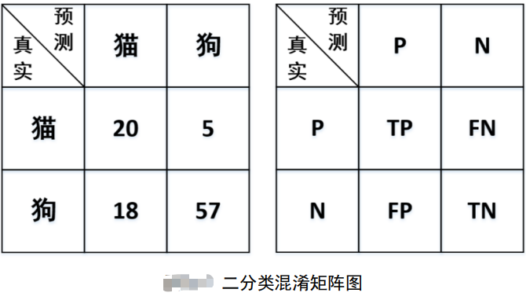

# 逻辑回归（Logistics Regression）

在线性回归中，通过建模 $h_(x)=wx+b$ 对新样本进行预测，其输出值为可能 的任意实数。但此处要得到一个样本所属类别的概率，那最直接的办法就是通过一个函数 $g(z)$，将 $h(x)$ 映射至 $[0,1]$ 的范围即可。由此，便得到了逻辑回归中的预测模型
$$
\hat{y}=h(x)=g(wx+b)
$$
其中 $w, b$ 为未知参数； $h(x)$ 称为假设函数（Hypothesis）。当 $h(x)$ 大于某个值（通常 设为 0.5）时，便可以认为样本 $x$ 属于正类，反之则认为属于负类。同时，也将 $wx + b = 0$ 称为两个类别间的决策边界（Decision Boundary）。当求解得到 $w,b$  后，也就意味着得到了 这个分类模型。

---

注意：回归模型一般来说都是指对连续值进行预测的一类模型，而分类模型都是指对离散值 （类标）预测的一类模型。但是由于历史的原因虽然逻辑回归被称为回归，但它却是一个分 类模型，这算是一个例外。

---

当建立好模型之后就需要找到一种方法来求解模型中的未知参数。同线性回归一样，此 时也需要通过一种间接的方式，即通过目标函数来刻画预测标签（Label）与真实标签之间 的差距。当最小化目标函数后，便能得到需要求解的参数 $w, b$
$$
\begin{aligned}
J(w,b)& =-\frac{1}{m}\bigg[\sum_{i=1}^{m}y^{(i)}\operatorname{log}h(x^{(i)})+(1-y^{(i)})\operatorname{log}(1-h(x^{(i)}))\bigg]  \\
h(x^{(i)})& =g(wx^{(i)}+b) 
\end{aligned}
$$
其中， $m$ 表示样本总数，$x^{(i)}$ 表示第 $i$ 个样本， $y^{(i)}$ 表示第 $i$ 个样本的真实标签， $h(x^{(i)})$ 表示第 $i$ 个样本为正类的预测概率。 

当函数 $J(w, b)$ 取得最小值的参数 $\hat w, \hat b$ ，就是我们要求的目标参数。 原因在于，当 $J(w, b)$ 取得最小值时就意味着此时所有样本的预测标签与真实标签之间的差距最小，这同时也是最小化目标函数的意义。因此，对于如何求解模型 $h(x)$ 的问题就转化 为了如何最小化目标函数 $J(w, b)$ 的问题。

## 评估指标

常见的评价指标有：准确率（Accuracy）、精确率（Precision）、召 回率（Recall）与 $F$ 值（ $Fscore$ ），其中应用最为广泛的就是准确率，接着是召回率。

下面将会由浅入深地从二分类到多分 类的场景来对这 4 种指标进行介绍。

### 二分类场景

假设现在有一个猫狗图片分类器对 100 张 图片进行分类，分类结果显示有 38 张图片是猫，62 张图片是狗。经过与真实标签对比后发 现，38 张猫的图片中有 20 张是分类正确的，62 张狗的图片中有 57 张是分类正确的。

根据上述这一情景，便能得到一张如下图 所示的矩阵，混淆矩阵（Confusion  Matrix）。

> - True Positive（TP）：表示将正样本预测为正样本，即预测正确；
> - False Negative（FN）：表示将正样本预测为负样本，即预测错误；
> - False Positive（FP）：表示将负样本预测为正样本，即预测错误；
> - True Negative（TN）：表示将负样本预测为负样本，即预测正确。

$$
\begin{aligned}
\textit{Accuracy}& =\frac{TP+TN}{TP+FP+FN+TN}  \\
\textit{Precision}& =\frac{TP}{TP+FP}  \\
\textit{Recall}& =\frac{TP}{TP+FN}  \\
F_{score}& =(1+\beta^2)\frac{Precision\cdot Recall}{\beta^2\cdot Precision+Recall} 
\end{aligned}
$$

---

注意：当 $F_{score}$ 中 $β=1 $时称为 $F_1$ 值，同时 $F_1$ 也是用得最多的 $F_{score}$ 评价指标。

---

- 准确率：即所有预测对的数量，除以总的数量；
- 精确率：计算的是预测对的正样本在整个预测为正样本中的比重；
- 召回率：计算的是预测对的 正样本在整个真实正样本中的比重；

一般来说，召回率越高也就意味着这个模型寻找正 样本的能力越强（例如在判断是否为癌细胞的时候，寻找正样本癌细胞的能力就十分重要）。而 $F_{score}$ 则是精确率与召回率的调和平均。但值得注意的是，通常在绝大多数任务中并不会明确哪一类别是正样本，哪一类别又是负样本，所以对于每个类别来说都可以计算其各项指标 （但是准确率只有一个）。

猫狗分类模型的各项评估值：

1）准确率
$$
Accuracy=\frac{20+57}{20+18+5+57}=0.77
$$
2）$F$ 值

- 对于类别猫来说

$$
\begin{aligned}
\textit{Precision}& =\frac{20}{20+18}=0.53  \\
\textit{Recall}& =\frac{20}{20+5}=0.8  \\
F_1& =\frac{2\times0.53\times0.8}{0.53+0.8}=0.63 
\end{aligned}
$$

- 对于类别狗来说

$$
\begin{aligned}
\textit{Precision}& =\frac{57}{57+5}=0.92  \\
\textit{Recall}& =  \frac{57}{57+18}=0.76  \\
 F_{1}&=\frac{2\times0.92\times0.76}{0.92+0.76}=0.83 
\end{aligned}
$$

# Reference

https://mp.weixin.qq.com/s?__biz=MzAwNjU0NjA3Ng==&mid=2247500077&idx=1&sn=5b60cc287852e842b69c307abcfa3bca&chksm=9b0936deac7ebfc890349a4956d28fd3ceefb199e56d248006ae9ac5f7812b47ef7bbe49759f&scene=178&cur_album_id=2815601982404132867&rd2werd=1&key=1e56d1049b0136f1bf3438d13d1bfc2eb5bd388e1d722cf51a940063443f6105b8bfa44a666d744cebe73218e28c06a2ae65ab4c1269a93bcad66353ee4636fc22c8f9174e846392eefd4267668e7b2994e24129d97fbe31b4e564537aa4542ecee2c7d5dbeef7f0b261589de4db12916effeafcfc9b676f979797eda71443ab&ascene=0&uin=MTk4NDUwMDExMQ%3D%3D&devicetype=Windows+10+x64&version=6309021a&lang=zh_CN&countrycode=CN&exportkey=n_ChQIAhIQzdferOIJvbfSmwUH9UJNyhLgAQIE97dBBAEAAAAAAN3fGaspTU0AAAAOpnltbLcz9gKNyK89dVj0ciiLQhTxi8HsMkEGpOpy31pjLrcsnlmKiuaqy1%2Fexcx3ciPjBr%2FvxZG7oEj%2F%2BbCNIAo9MErae0gtk48i1SbC%2FlBVuzFjhypXaWOjuprQ82JQqZDxI1ZfOvDeNRFWDRSmJ9k9CNTR26KOOfKaDyg1zJT3wPJadYCtMLRyiiIEtmF5TWqRo9Y9E%2BEzO8ZEQOPz7bhtYvIxmDBp%2Bs1fJbxixEk8IT%2B%2F3xsmK86lX0Cx5XkBzgBJBsOCcBOt&acctmode=0&pass_ticket=AHCUoYUtqCnckQqNog31XDFYXIBZtLT%2FYztCkFJc9OCk86qO0We2bMC4vSE8opbvDAPyCIJhBg6UpM%2FzJUSB6Q%3D%3D&wx_header=1&fontgear=2

file:///C:/Users/Simple/Desktop/machineLearning/MachineLearningWithMe-master/AllBooKCode/Chapter03/%E7%AC%AC3%E7%AB%A0%20%E4%BB%8E%E9%9B%B6%E8%AE%A4%E8%AF%86%E9%80%BB%E8%BE%91%E5%9B%9E%E5%BD%92.pdf