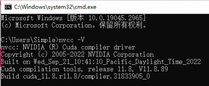
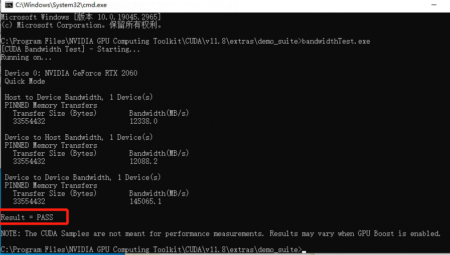
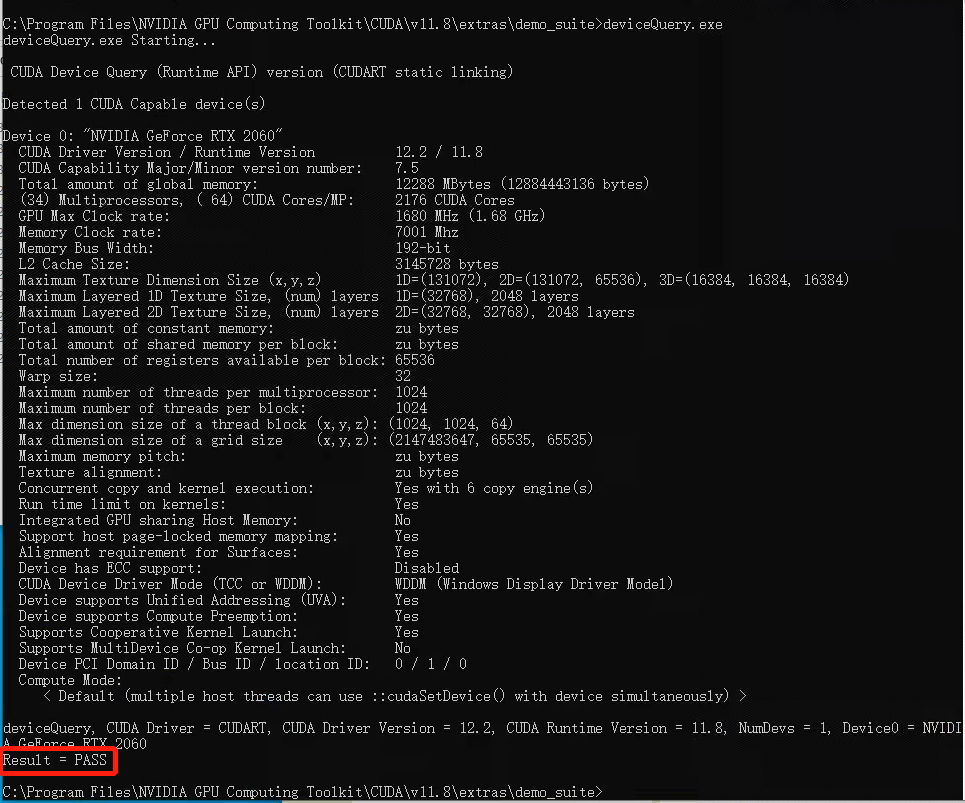
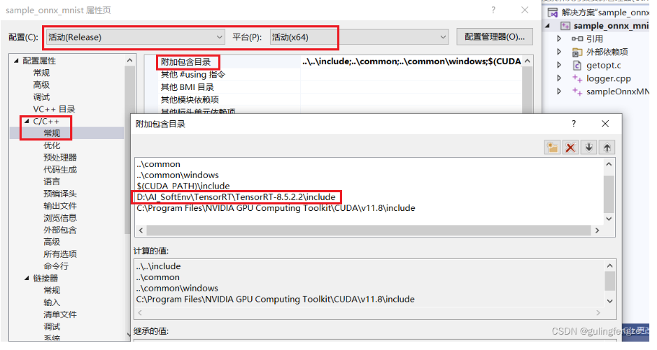
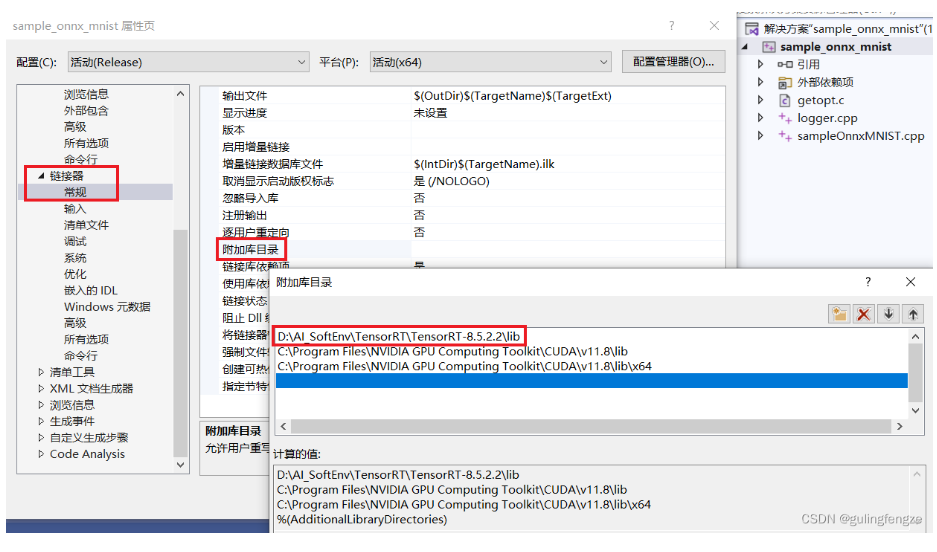
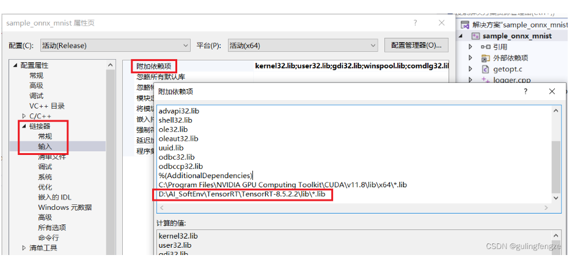

# win10_cuda_cudnn_tensorRT环境配置

> - windows 10
> - cuda 11.8
> - cudnn 8.9.2.26
> - tensorRT 8.6.1.6
> - vs 2019
> - RTX 2060
> - 显卡驱动：535.98

PS：EA 代表抢先体验。GA 表示稳定版，经过全面测试。

## cuda 11.8 安装

直接下一步，即使是之前安装了显卡驱动直接下一步，下一步，... ... 也没事，安装很快。

使用 `nvcc -V` 检查cuda的版本。



## cudnn 8.9.2.26 安装

解压缩 cudnn8.9.2.26 文件

a) 把解压文件里的bin目录下的文件复制到 C:\Program Files\NVIDIA GPU Computing Toolkit\CUDA\v11.8\bin 目录下.
b) 把解压文件里的include目录下的文件复制到 C:\Program Files\NVIDIA GPU Computing Toolkit\CUDA\v11.8\include 目录下.
c) 把解压文件里的lib\x64目录下的文件复制到C:\Program Files\NVIDIA GPU Computing Toolkit\CUDA\v11.8\lib\x64 目录下.

进入 `C:\Program Files\NVIDIA GPU Computing Toolkit\CUDA\v11.8\extras\demo_suite` 文件夹下，打开cmd，输入 `bandwidthTest.exe`



看到 PASS 即是成功，

输入`deviceQuery.exe`， 看到 `PASS` 即是成功。



## tensorRT 安装

1、将 `C:\TensorRT-8.6.1.6\lib` 添加环境变量PATH中

2、复制移动文件

- ~~将include中头文件复制到C:\Program Files\NVIDIA GPU Computing Toolkit\CUDA\v11.8\include~~
- ~~将lib中所有lib文件复制到C:\Program Files\NVIDIA GPU Computing Toolkit\CUDA\v11.8\lib\x64~~
- 将lib中所有dll文件复制到C:\Program Files\NVIDIA GPU Computing Toolkit\CUDA\v11.8\bin

3、安装pytho版本tensorrt

```
 # 根据自己的python版本安装tensorrt,cd到TensorRT-8.6.1.6\python下
 pip install tensorrt-8.6.1.6-cp310-none-win_amd64.whl
 
 # 测试,打印trt的版本
 import tensorrt as trt
 trt.__version__
```

4、VS2019配置TensorRT并测试

使用vs2019打开`TensorRT-8.6.1.6\samples\sampleOnnxMNIST\sample_onnx_mnist.sln`

进行如下环境配置：








# Reference

https://blog.csdn.net/shanglianlm/article/details/130204986

https://blog.csdn.net/qq_43406895/article/details/128628394

https://blog.csdn.net/gdxb666/article/details/130781585

